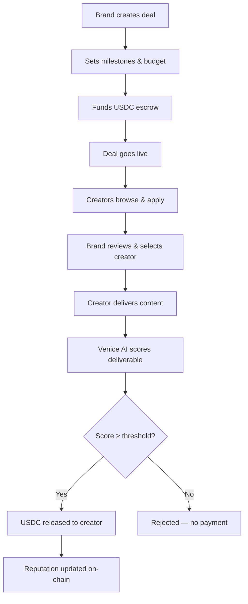
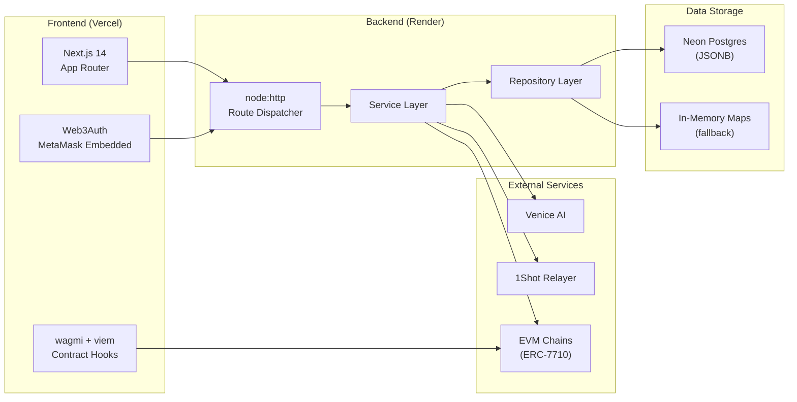
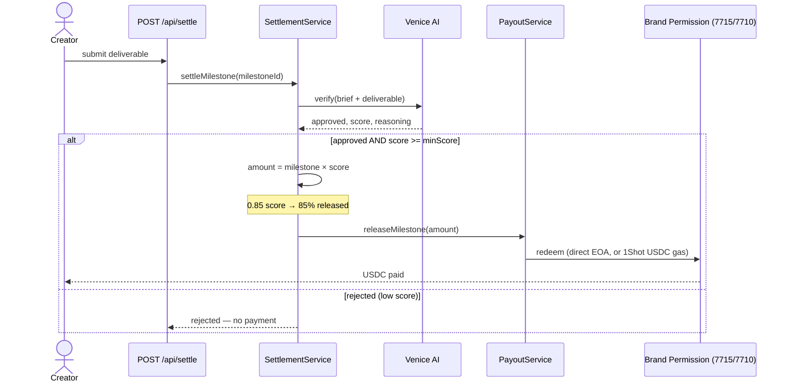
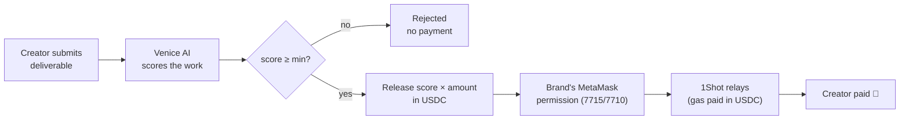
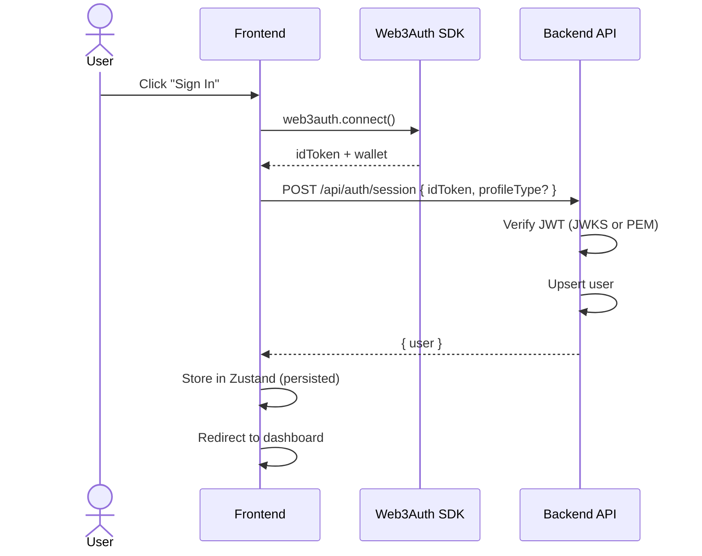

# FluxPay — Comprehensive Project Documentation

[](https://opensource.org/licenses/MIT)
[](https://nodejs.org/)
[](https://nextjs.org/)
[](https://soliditylang.org/)

> **Version:** 1.0.0  
> **Last updated:** June 2026  
> **License:** MIT

---

## Table of Contents

- [1. Executive Summary](#1-executive-summary)
- [2. Product Overview](#2-product-overview)
  - [2.1 Problem Statement](#21-problem-statement)
  - [2.2 Solution](#22-solution)
  - [2.3 User Roles](#23-user-roles)
  - [2.4 End-to-End Workflow](#24-end-to-end-workflow)
- [3. Technology Stack](#3-technology-stack)
  - [3.1 Frontend](#31-frontend)
  - [3.2 Backend](#32-backend)
  - [3.3 Blockchain & Smart Contracts](#33-blockchain--smart-contracts)
  - [3.4 Third-Party Integrations](#34-third-party-integrations)
- [4. System Architecture](#4-system-architecture)
  - [4.1 High-Level Architecture](#41-high-level-architecture)
  - [4.2 The Settlement Engine](#42-the-settlement-engine)
  - [4.3 Data Flow](#43-data-flow)
  - [4.4 Backend Architecture Pattern](#44-backend-architecture-pattern)
  - [4.5 Storage Strategy](#45-storage-strategy)
- [5. Project Structure](#5-project-structure)
  - [5.1 Root Directory](#51-root-directory)
  - [5.2 Frontend Structure](#52-frontend-structure)
  - [5.3 Backend Structure](#53-backend-structure)
- [6. Getting Started](#6-getting-started)
  - [6.1 Prerequisites](#61-prerequisites)
  - [6.2 Installation](#62-installation)
  - [6.3 Environment Configuration](#63-environment-configuration)
  - [6.4 Running the Project](#64-running-the-project)
  - [6.5 Type-Checking](#65-type-checking)
- [7. Frontend Documentation](#7-frontend-documentation)
  - [7.1 App Router & Pages](#71-app-router--pages)
  - [7.2 Authentication & Wallet Flow](#72-authentication--wallet-flow)
  - [7.3 Provider Hierarchy](#73-provider-hierarchy)
  - [7.4 State Management](#74-state-management)
  - [7.5 API Client](#75-api-client)
  - [7.6 Hooks](#76-hooks)
  - [7.7 Components](#77-components)
  - [7.8 Smart Contract Integration](#78-smart-contract-integration)
  - [7.9 Styling](#79-styling)
- [8. Backend Documentation](#8-backend-documentation)
  - [8.1 Entry Point & Server](#81-entry-point--server)
  - [8.2 Route Dispatch](#82-route-dispatch)
  - [8.3 Services](#83-services)
  - [8.4 Models & Repositories](#84-models--repositories)
  - [8.5 Authentication](#85-authentication)
  - [8.6 Error Handling](#86-error-handling)
- [9. API Reference](#9-api-reference)
  - [9.1 Base URL](#91-base-url)
  - [9.2 Authentication](#92-authentication)
  - [9.3 Auth Endpoints](#93-auth-endpoints)
  - [9.4 Profile Endpoints](#94-profile-endpoints)
  - [9.5 Jobs (Deals) Endpoints](#95-jobs-deals-endpoints)
  - [9.6 Milestone Endpoints](#96-milestone-endpoints)
  - [9.7 Application Endpoints](#97-application-endpoints)
  - [9.8 Wallet Endpoints](#98-wallet-endpoints)
  - [9.9 Permission Endpoints (ERC-7715)](#99-permission-endpoints-erc-7715)
  - [9.10 Verification & Settlement Endpoints](#910-verification--settlement-endpoints)
  - [9.11 Faucet Endpoint](#911-faucet-endpoint)
  - [9.12 1Shot Status Endpoint](#912-1shot-status-endpoint)
  - [9.13 Reputation Endpoint](#913-reputation-endpoint)
  - [9.14 Demo Endpoints](#914-demo-endpoints)
  - [9.15 Health Check](#915-health-check)
  - [9.16 Payment Endpoints (Legacy)](#916-payment-endpoints-legacy)
  - [9.17 Error Shape](#917-error-shape)
- [10. Smart Contracts](#10-smart-contracts)
  - [10.1 Contract Overview](#101-contract-overview)
  - [10.2 Deployed Addresses](#102-deployed-addresses)
  - [10.3 FluxPayEscrowFactory](#103-fluxpayescrowfactory)
  - [10.4 FluxPayEscrow](#104-fluxpayescrow)
  - [10.5 MockUSDC](#105-mockusdc)
- [11. Sponsor Technology Deep Dives](#11-sponsor-technology-deep-dives)
  - [11.1 MetaMask Smart Accounts (ERC-7715/7710)](#111-metamask-smart-accounts-erc-77157710)
  - [11.2 Venice AI — Deliverable Verification](#112-venice-ai--deliverable-verification)
  - [11.3 1Shot — USDC-Gas Payout Rail](#113-1shot--usdc-gas-payout-rail)
  - [11.4 A2A Redelegation](#114-a2a-redelegation)
- [12. Multichain Support](#12-multichain-support)
- [13. Testing](#13-testing)
  - [13.1 Unit Tests](#131-unit-tests)
  - [13.2 On-Chain Validation Harnesses](#132-on-chain-validation-harnesses)
  - [13.3 Diagnostic Scripts](#133-diagnostic-scripts)
- [14. Deployment](#14-deployment)
  - [14.1 Frontend → Vercel](#141-frontend--vercel)
  - [14.2 Backend → Render](#142-backend--render)
- [15. Environment Variables Reference](#15-environment-variables-reference)
  - [15.1 Backend Environment Variables](#151-backend-environment-variables)
  - [15.2 Frontend Environment Variables](#152-frontend-environment-variables)
- [16. Security](#16-security)
- [17. Contributing](#17-contributing)
- [18. Troubleshooting](#18-troubleshooting)
- [19. License](#19-license)

---

## 1. Executive Summary

**FluxPay** is a creator-brand deal escrow platform built for Web3. Brands post sponsored content deals, creators apply and deliver, and USDC is locked in smart contracts per milestone. An AI (Venice) autonomously verifies deliverables against the brief — payments release automatically on approval, with no human intervention required.

The platform fuses three sponsor technologies into a single autonomous settlement loop:

| Technology | Role |
|---|---|
| **MetaMask Smart Accounts** (ERC-7715/7710) | Brands grant a one-time spending permission; the agent redeems it to pay creators |
| **Venice AI** | Scores each deliverable against the brief and determines the payout amount |
| **1Shot API** | Relays payouts so gas is paid in USDC (mainnet) |

---

## 2. Product Overview

### 2.1 Problem Statement

Creator-brand partnerships today are plagued by:
- **Payment delays** — creators wait weeks or months for payment
- **Trust issues** — no guarantee of payment after content delivery
- **Manual verification** — brands must manually review each deliverable
- **Gas friction** — crypto payments require ETH for gas, adding complexity

### 2.2 Solution

FluxPay eliminates trust with smart contract escrow, automates review with AI, and removes gas friction with USDC-denominated payments:

1. **Brand posts a deal** — sets milestones, budget, and content requirements. Funds lock into escrow.
2. **Creators apply** — browse open deals and submit applications with a cover note.
3. **Brand selects a creator** — reviews reputation, portfolio, and application.
4. **Creator submits deliverables** — uploads the content link per milestone. AI reviews it instantly against the brief.
5. **Funds release automatically** — on AI approval, USDC flows to the creator and on-chain reputation scores update.

### 2.3 User Roles

| Role | Description |
|---|---|
| **Creator** | Applies to brand jobs, delivers content, earns USDC per milestone. Views dashboard, tracks applications, manages wallet, builds reputation. |
| **Organization (Brand)** | Posts deals, selects creators, funds escrow, monitors delivery. Reviews applications, approves/disputes milestones, manages campaigns. |

### 2.4 End-to-End Workflow



---

## 3. Technology Stack

### 3.1 Frontend

| Layer | Technology | Version / Notes |
|---|---|---|
| Framework | Next.js 14 (App Router) | TypeScript, server/client components |
| Styling | Tailwind CSS | v3.4, custom config |
| State Management | Zustand | Persisted stores (`localStorage`) |
| Server State | TanStack Query | v5 — caching, mutations, refetching |
| Auth / Wallet | Web3Auth | MetaMask Embedded Wallets (`@web3auth/modal` v11) |
| EVM Integration | wagmi + viem | Latest — hooks for contract reads/writes |
| Solana Integration | Web3Auth SolanaProvider | Cross-chain wallet support |
| 3D Graphics | Three.js + React Three Fiber | Landing page hero visuals |
| Animations | Framer Motion | v12 — page transitions, micro-interactions |
| Icons | Lucide React | v0.395 |
| Notifications | React Hot Toast | v2 |
| Charts | Recharts | v3.8 — dashboard analytics |
| Utilities | clsx, tailwind-merge | Conditional class merging |

### 3.2 Backend

| Layer | Technology | Notes |
|---|---|---|
| Runtime | Node.js ≥ 20 | `node:http` — no framework |
| Language | TypeScript (ESM) | Run via `tsx` (dev) |
| Auth | Web3Auth JWT verification | JWKS or static PEM |
| Storage | Neon Postgres (JSONB) | Falls back to in-memory `Map` repos when unset |
| On-chain | viem + `@metamask/delegation-toolkit` | ERC-7715/7710 delegations |
| AI | Venice AI | OpenAI-compatible API for deliverable verification |
| Relayer | 1Shot | USDC-gas payouts on mainnet |
| Database Driver | `@neondatabase/serverless` | v1.1 |

### 3.3 Blockchain & Smart Contracts

| Layer | Technology |
|---|---|
| Language | Solidity ^0.8.0 |
| Contracts | `FluxPayEscrow`, `FluxPayEscrowFactory`, `MockUSDC` |
| Payment Token | USDC |
| Supported Networks | Ethereum, Base, Arbitrum, Optimism, Polygon, BNB Chain, Linea, Scroll + testnets |
| Smart Accounts | EIP-7702 (MetaMask Account Abstraction via Web3Auth) |
| Bundler | Pimlico / ZeroDev (per-chain via env vars) |

### 3.4 Third-Party Integrations

| Service | Purpose | Configuration |
|---|---|---|
| **Web3Auth** | Embedded wallet + social login | `NEXT_PUBLIC_CLIENT_ID`, `WEB3AUTH_CLIENT_ID` |
| **Venice AI** | AI deliverable verification | `VENICE_API_KEY` |
| **1Shot** | USDC-gas relayer (mainnet) | `ONESHOT_RELAYER_URL` (no API key — permissionless) |
| **Neon Postgres** | Serverless PostgreSQL | `DATABASE_URL` |
| **Pimlico/ZeroDev** | AA Bundler + Paymaster | `NEXT_PUBLIC_BUNDLER_*`, `NEXT_PUBLIC_PAYMASTER_*` |
| **Google OAuth** | YouTube social verification | `GOOGLE_CLIENT_ID`, `GOOGLE_CLIENT_SECRET` |
| **Twitter/X OAuth** | X social verification | `TWITTER_CLIENT_ID`, `TWITTER_CLIENT_SECRET` |

---

## 4. System Architecture

### 4.1 High-Level Architecture



### 4.2 The Settlement Engine

The backend's core innovation — the autonomous settlement loop that fuses all three sponsor technologies:



**Example scenario:** Nike posts a $100 reel deal and selects creator Joshua. Joshua submits the reel. FluxPay calls `POST /api/settle`. Venice scores it **0.9** ("AirMax shown, @nike tagged, #JustDoIt present"). The agent releases **$90 USDC** from Nike's pre-authorized permission — and Joshua is paid before anyone at Nike opens the dashboard.

### 4.3 Data Flow



### 4.4 Backend Architecture Pattern

The backend follows a **vertical slice** architecture:

```
Model (Repository) → Service (Business Logic) → Route (HTTP Handler) → app.ts (Dispatcher)
```

- **Models** define data interfaces and repository implementations (in-memory + Postgres)
- **Services** contain all business logic and external integrations
- **Routes** create HTTP handler functions that call services
- **`app.ts`** wires everything together with dependency injection via `createApp(options)`

This enables full testability — tests inject in-memory repos and never touch a database.

### 4.5 Storage Strategy

The backend implements a **dual-storage** strategy:

| Mode | Trigger | Use Case |
|---|---|---|
| **Neon Postgres** | `DATABASE_URL` is set | Production — all entities persist as JSONB blobs |
| **In-Memory Maps** | `DATABASE_URL` unset | Tests, local dev — fast, no setup needed |

Both implement identical repository interfaces. The switch is automatic via `defaultRepositories()` in `app.ts`. JSONB storage means new fields never require schema migrations.

---

## 5. Project Structure

### 5.1 Root Directory

```
FluxPay/
├── frontend/                   # Next.js 14 app (Vercel)
├── backend/                    # Node.js API (Render)
├── scripts/
│   └── setup-remotes.sh        # Dual-push git setup
├── .env                        # Root env vars (gitignored)
├── .env.example                # Template
├── .gitignore
├── API.md                      # API endpoint reference
├── DOCUMENTATION.md            # This file
├── LICENSE                     # MIT
├── README.md                   # Quick-start guide
├── filestash.txt               # File manifest
└── render.yaml                 # Render deploy config
```

### 5.2 Frontend Structure

```
frontend/src/
├── app/                        # Next.js App Router pages
│   ├── page.tsx                # Landing page (38KB — full hero + sections)
│   ├── layout.tsx              # Root layout + providers
│   ├── client-layout.tsx       # Client-side layout wrapper
│   ├── globals.css             # Global styles + Tailwind base
│   │
│   ├── auth/
│   │   ├── login/              # Sign in with smart wallet
│   │   └── signup/             # Role selection + wallet connect
│   │
│   ├── onboarding/
│   │   ├── creator/            # Creator profile setup
│   │   └── organization/       # Brand profile setup
│   │
│   ├── creator/                # ── Creator dashboard ──
│   │   ├── dashboard/          # Browse deals, track applications
│   │   ├── deals/              # Active deal + milestone delivery
│   │   ├── applications/       # Track sent applications
│   │   ├── jobs/               # Job listing for creators
│   │   ├── wallet/             # USDC balance + transactions
│   │   ├── reputation/         # On-chain score
│   │   └── profile/            # Profile editor
│   │
│   ├── organization/           # ── Brand dashboard ──
│   │   ├── dashboard/          # Active campaigns overview
│   │   ├── jobs/               # Post/manage deals
│   │   ├── approvals/          # Review milestone submissions
│   │   ├── wallet/             # Escrow balance + top-up
│   │   ├── reputation/         # Brand reputation
│   │   └── profile/            # Brand profile editor
│   │
│   ├── explore/                # Browse jobs & creators
│   ├── about/                  # About page
│   ├── brands/                 # Brand directory
│   ├── creators/               # Creator directory
│   ├── how-it-works/           # How it works guide
│   ├── smart-escrow/           # Smart escrow explainer
│   ├── faqs/                   # FAQ page
│   ├── team/                   # Team page
│   ├── dashboard/              # Generic dashboard redirect
│   ├── datasets/               # Dataset views
│   ├── jobs/                   # Public job listings
│   ├── wallet/                 # Generic wallet page
│   ├── workers/                # Worker views
│   ├── admin/                  # Admin panel
│   └── api/                    # Next.js API routes
│       └── balances/           # Token balance route handler
│
├── components/
│   ├── shared/                 # Reusable UI components
│   │   ├── Navbar.tsx          # Navigation bar (10.9KB)
│   │   ├── DataTable.tsx       # Sortable/filterable data table
│   │   ├── Modal.tsx           # Modal dialog
│   │   ├── Form.tsx            # Form components
│   │   ├── Alert.tsx           # Alert/notification component
│   │   ├── Loading.tsx         # Loading spinner
│   │   ├── ErrorBoundary.tsx   # Error boundary wrapper
│   │   ├── HoldingsCard.tsx    # Token holdings card
│   │   ├── ChainSwitcher.tsx   # Network chain switcher
│   │   ├── DataExport.tsx      # Data export component
│   │   ├── TransactionStatus.tsx # Transaction status tracker
│   │   └── index.ts            # Barrel export
│   │
│   └── ui/                     # Landing page components
│       ├── shape-landing-hero.tsx    # 3D hero section (12.7KB)
│       ├── sign-in-flow-1.tsx        # Sign-in flow component (24.9KB)
│       ├── testimonials-section.tsx   # Testimonials
│       ├── footer-column.tsx          # Footer
│       └── grid-pattern.tsx           # Background pattern
│
├── config/
│   ├── web3authContext.ts      # Web3Auth + AA bundler config
│   └── settings.ts            # App-wide settings (chain, RPC, explorer)
│
├── context/
│   └── WalletContext.tsx       # Web3Auth → Wagmi → Solana provider tree
│
├── contracts/
│   ├── abis/                   # Smart contract ABIs (JSON)
│   │   ├── FluxPayEscrow.json
│   │   ├── FluxPayEscrowFactory.json
│   │   └── MockUSDC.json
│   └── contracts.ts            # Deployed addresses + ABI exports
│
├── hooks/
│   ├── useApi.ts               # TanStack Query hooks for API calls (7KB)
│   ├── useWallet.ts            # Wallet connection + balance hooks (6.3KB)
│   ├── useForm.ts              # Form state management (6.3KB)
│   ├── useGrantMilestonePermission.ts  # ERC-7715 permission granting (3.2KB)
│   ├── useOnWeb3AuthConnected.ts       # Post-login session setup
│   ├── useTokenBalances.ts     # Multi-token balance fetching
│   ├── useToast.ts             # Toast notification hook
│   └── index.ts                # Barrel export
│
├── lib/
│   ├── api-client.ts           # Typed API client (all backend endpoints)
│   ├── establishSession.ts     # POST /api/auth/session helper
│   ├── mock-data.ts            # localStorage-backed mock DB (12.8KB)
│   ├── mock-jobs.ts            # Mock job data for development
│   ├── websocket.ts            # WebSocket client
│   ├── solana-shim.js          # Solana compatibility shim
│   └── utils.ts                # Utility functions
│
├── services/                   # Frontend service layer
├── constants/                  # App constants
│
├── stores/
│   ├── userStore.ts            # Auth + role (Zustand, persisted)
│   ├── jobStore.ts             # Job state management
│   └── index.ts                # Barrel export
│
├── types/
│   └── index.ts                # Shared TypeScript type definitions
│
├── utils/                      # Utility functions
└── styles.css                  # Additional styles
```

### 5.3 Backend Structure

```
backend/
├── src/
│   ├── index.ts                # Entry point — starts the HTTP server
│   ├── app.ts                  # HTTP server + DI container + route dispatch (26KB)
│   │
│   ├── config/
│   │   ├── index.ts            # Centralized env config (7.3KB)
│   │   └── chains.ts           # Multichain registry — 8 mainnets + 1 testnet
│   │
│   ├── database/
│   │   ├── connection.ts       # DB connection + schema bootstrap
│   │   └── client.ts           # Postgres client wrapper + isDbEnabled()
│   │
│   ├── middleware/
│   │   └── index.ts            # Error → HTTP response mapper
│   │
│   ├── models/                 # ── Repository Layer ──
│   │   ├── user.ts             # InMemoryUserRepository
│   │   ├── job.ts              # InMemoryJobRepository
│   │   ├── application.ts      # InMemoryApplicationRepository
│   │   ├── milestone.ts        # InMemoryMilestoneRepository
│   │   ├── profile.ts          # InMemoryProfileRepository
│   │   ├── wallet.ts           # InMemoryWalletRepository
│   │   ├── payment.ts          # InMemoryPaymentRepository
│   │   ├── permission.ts       # InMemoryPermissionRepository
│   │   ├── deal.ts             # Deal model
│   │   └── postgres.ts         # All Postgres repository implementations (16.4KB)
│   │
│   ├── routes/                 # ── HTTP Handler Layer ──
│   │   ├── auth.ts             # POST /auth/session, GET /auth/me
│   │   ├── job.ts              # CRUD /jobs, apply, select, milestones
│   │   ├── payment.ts          # CRUD /payments
│   │   ├── profile.ts          # Profile CRUD + social OAuth
│   │   ├── wallet.ts           # Balance, deposit, withdraw, transactions
│   │   ├── permission.ts       # ERC-7715 permission store/redeem
│   │   ├── verification.ts     # Venice verify + autonomous settle
│   │   ├── faucet.ts           # USDC welcome drip
│   │   ├── reputation.ts       # Reputation lookup
│   │   ├── deal.ts             # Deal routes
│   │   ├── oneshot.ts          # 1Shot status (read-only)
│   │   └── demo.ts             # Presenter unlock + deal seeding
│   │
│   ├── services/               # ── Business Logic Layer ──
│   │   ├── authService.ts      # Web3Auth JWT verify + user upsert
│   │   ├── jobService.ts       # Job CRUD + applications + milestones (7.5KB)
│   │   ├── paymentService.ts   # Payment recording + status updates
│   │   ├── profileService.ts   # Profile management + reputation
│   │   ├── walletService.ts    # Wallet balance + transactions
│   │   ├── permissionService.ts # ERC-7715 permission storage
│   │   ├── payoutService.ts    # USDC payout orchestration (5KB)
│   │   ├── redeemService.ts    # ERC-7710 delegation redemption (3.3KB)
│   │   ├── relayerService.ts   # 1Shot relayer integration (5KB)
│   │   ├── veniceService.ts    # Venice AI HTTP client
│   │   ├── verificationService.ts # AI deliverable verification (4.5KB)
│   │   ├── settlementService.ts # Autonomous settlement loop (2.8KB)
│   │   ├── faucetService.ts    # Testnet USDC faucet (4.2KB)
│   │   ├── redelegationService.ts # A2A delegation chaining (2KB)
│   │   └── dealService.ts      # Deal service
│   │
│   └── utils/
│       ├── web3auth.ts         # JWT verification (JWKS or static PEM)
│       ├── validators.ts       # Input validation
│       ├── errors.ts           # Custom error classes
│       └── helpers.ts          # HTTP response builder
│
├── tests/                      # ── Test Suite ──
│   ├── helpers.ts              # Test utilities
│   ├── payment.test.ts         # Payment service tests
│   ├── services.test.ts        # Service integration tests
│   ├── job.test.ts             # Job lifecycle tests (9.1KB)
│   ├── jobService.test.ts      # Job service unit tests (4.9KB)
│   ├── multiCreator.test.ts    # Multi-creator scenario tests (9.5KB)
│   ├── profile.test.ts         # Profile tests
│   ├── wallet.test.ts          # Wallet tests
│   ├── settlementService.test.ts # Settlement tests
│   ├── deal.test.ts            # Deal tests
│   └── dealService.test.ts     # Deal service tests
│
├── scripts/                    # ── Validation Harnesses ──
│   ├── redeem-harness.ts       # ERC-7710 on-chain redeem test (6.4KB)
│   ├── a2a-harness.ts          # A2A redelegation test (7.2KB)
│   ├── diagnose-token.mjs      # Web3Auth token diagnostics (7.1KB)
│   └── _smart7702.ts           # EIP-7702 helper
│
├── package.json
└── tsconfig.json
```

---

## 6. Getting Started

### 6.1 Prerequisites

| Requirement | Version |
|---|---|
| **Node.js** | v20.0.0 or higher |
| **npm** | v10+ (comes with Node 20) |
| **Git** | Latest |
| **Web3Auth Account** | Free `clientId` from [Web3Auth Dashboard](https://dashboard.web3auth.io/) |

### 6.2 Installation

#### 1. Clone the repository

```bash
git clone https://github.com/Dami904/FluxPay.git
cd FluxPay
```

#### 2. Set up remotes (run once per team member)

Enables `git push` to send commits to both the upstream and team fork simultaneously:

```bash
bash scripts/setup-remotes.sh
```

#### 3. Install dependencies

```bash
# Frontend
cd frontend
npm install

# Backend
cd ../backend
npm install
```

### 6.3 Environment Configuration

#### Frontend — `frontend/.env.local`

```bash
cp frontend/.env.example frontend/.env.local
```

```env
# Backend API
NEXT_PUBLIC_API_URL=http://localhost:8000

# Web3Auth (MetaMask Embedded Wallets)
NEXT_PUBLIC_CLIENT_ID=<your Web3Auth client ID>

# Deployed contract addresses (Hoodi testnet)
NEXT_PUBLIC_ESCROW_FACTORY_ADDRESS=0x58B92620Ce2Fa3dD61f0143Ea4f1bbF961130856
NEXT_PUBLIC_USDC_ADDRESS=0x2CeF50c5C6059F43180b1d91EFA354A9A837AdE1

# Optional: AA bundler URLs (per-chain smart account support)
NEXT_PUBLIC_BUNDLER_SEPOLIA=https://...
NEXT_PUBLIC_BUNDLER_BASE=https://...

# Optional: Paymaster URLs (sponsored gas — zero gas for users)
NEXT_PUBLIC_PAYMASTER_SEPOLIA=https://...
NEXT_PUBLIC_PAYMASTER_BASE=https://...
```

#### Backend — `backend/.env`

```env
PORT=8000
NODE_ENV=development

# CORS origin — your frontend URL
FRONTEND_URL=http://localhost:3000

# Web3Auth
WEB3AUTH_CLIENT_ID=<your Web3Auth client ID>
JWKS_ENDPOINT=https://api-auth.web3auth.io/.well-known/jwks.json
WEB3AUTH_ALLOW_UNVERIFIED=true  # true for Sapphire Devnet only

# Optional: Postgres (falls back to in-memory if unset)
DATABASE_URL=postgres://...

# Optional: Chain selection
NETWORK_MODE=testnet            # mainnet | testnet
ACTIVE_CHAIN_ID=84532           # Base Sepolia for dev

# Optional: AI verification
VENICE_API_KEY=<your Venice API key>

# Optional: USDC faucet (testnet)
FAUCET_PRIVATE_KEY=<funded wallet private key>

# Optional: Agent wallet (for ERC-7710 redemption)
AGENT_PRIVATE_KEY=<agent private key>
```

### 6.4 Running the Project

#### Frontend (Next.js dev server)

```bash
cd frontend
npm run dev
# → http://localhost:3000
```

#### Backend (Node.js API)

```bash
cd backend
npm run dev
# → http://localhost:8000
```

### 6.5 Type-Checking

```bash
# Frontend
cd frontend && npx tsc --noEmit

# Backend
cd backend && npm run typecheck
```

---

## 7. Frontend Documentation

### 7.1 App Router & Pages

FluxPay uses Next.js 14's App Router with the following page hierarchy:

| Route | Page | Auth Required | Role |
|---|---|---|---|
| `/` | Landing page | No | — |
| `/auth/login` | Sign in | No | — |
| `/auth/signup` | Sign up + role select | No | — |
| `/explore` | Browse jobs & creators | No | — |
| `/about` | About page | No | — |
| `/how-it-works` | How it works | No | — |
| `/smart-escrow` | Escrow explainer | No | — |
| `/faqs` | FAQ | No | — |
| `/onboarding/creator` | Creator profile setup | Yes | Creator |
| `/onboarding/organization` | Brand profile setup | Yes | Organization |
| `/creator/dashboard` | Creator home | Yes | Creator |
| `/creator/deals` | Active deals | Yes | Creator |
| `/creator/applications` | Sent applications | Yes | Creator |
| `/creator/wallet` | USDC wallet | Yes | Creator |
| `/creator/reputation` | Reputation score | Yes | Creator |
| `/creator/profile` | Profile editor | Yes | Creator |
| `/organization/dashboard` | Brand home | Yes | Organization |
| `/organization/jobs` | Manage deals | Yes | Organization |
| `/organization/approvals` | Review submissions | Yes | Organization |
| `/organization/wallet` | Escrow wallet | Yes | Organization |
| `/organization/reputation` | Brand reputation | Yes | Organization |
| `/organization/profile` | Brand profile | Yes | Organization |

### 7.2 Authentication & Wallet Flow



1. User clicks login → Web3Auth SDK opens its modal (social login, email, or wallet)
2. On success, the SDK returns an `idToken` (JWT) and connects the user's embedded wallet
3. Frontend sends the `idToken` to `POST /api/auth/session` with an optional `profileType` (on signup)
4. Backend verifies the JWT signature, expiry, issuer, and audience, then upserts the user
5. Frontend stores the user and token in Zustand (persisted to `localStorage` as `fluxpay-user`)

### 7.3 Provider Hierarchy

The `WalletProvider` wraps the entire app with the correct provider order:

```tsx
<Web3AuthProvider>         // Web3Auth SDK context (must be outermost)
  <QueryClientProvider>    // TanStack Query for server state
    <WagmiProvider>        // EVM chain hooks (wagmi)
      <SolanaProvider>     // Solana chain hooks
        {children}
      </SolanaProvider>
    </WagmiProvider>
  </QueryClientProvider>
</Web3AuthProvider>
```

### 7.4 State Management

#### Zustand Stores

| Store | File | State | Persistence |
|---|---|---|---|
| `useUserStore` | `stores/userStore.ts` | `user`, `token`, `isAuthenticated` | `localStorage` (`fluxpay-user`) |
| `useJobStore` | `stores/jobStore.ts` | Job-related state | — |

**`useUserStore` actions:**
- `setAuth(user, token)` — sets auth state + stores token in `localStorage`
- `logout()` — clears state + removes `auth_token` from `localStorage`
- `updateWallet(address)` — updates the wallet address on the user object

#### TanStack Query

Server state (API data) is managed via TanStack Query v5 through custom hooks in `hooks/useApi.ts`:
- Automatic caching and background refetching
- Mutation hooks for create/update operations
- Optimistic updates where appropriate

### 7.5 API Client

All backend communication goes through `lib/api-client.ts` — a typed wrapper that:

1. Constructs URLs from `NEXT_PUBLIC_API_URL`
2. Attaches `Authorization: Bearer <idToken>` from `localStorage`
3. Handles JSON serialization/deserialization
4. Unwraps error responses into `Error` objects with `.message` and `.status`

**Available API modules:**

| Module | Import | Endpoints |
|---|---|---|
| `authAPI` | `authAPI.createSession()`, `.me()`, `.setRole()` | Auth session management |
| `profileAPI` | `profileAPI.getMe()`, `.updateMe()`, `.socialConnect()` | Profile CRUD + social OAuth |
| `jobAPI` | `jobAPI.list()`, `.create()`, `.apply()`, `.selectCreator()` | Deal lifecycle |
| `milestoneAPI` | `milestoneAPI.list()`, `.submit()`, `.approve()`, `.recheck()` | Milestone actions |
| `applicationAPI` | `applicationAPI.listMine()`, `.withdraw()`, `.reject()` | Application management |
| `walletAPI` | `walletAPI.getBalance()`, `.deposit()`, `.withdraw()` | Wallet operations |
| `permissionAPI` | `permissionAPI.store()`, `.getForJob()` | ERC-7715 permissions |
| `faucetAPI` | `faucetAPI.drip()` | Testnet USDC faucet |
| `verificationAPI` | `verificationAPI.verify()`, `.settle()` | AI verification + settlement |
| `reputationAPI` | `reputationAPI.lookup()` | On-chain reputation |
| `oneshotAPI` | `oneshotAPI.status()` | 1Shot integration status |
| `demoAPI` | `demoAPI.unlock()`, `.ensureDeals()` | Demo/presenter helpers |

**Usage:**

```typescript
import { jobAPI, profileAPI } from '@/lib/api-client'

// List open jobs with filters
const { data } = await jobAPI.list({ status: 'open', platform: 'instagram' })

// Apply to a job
await jobAPI.apply(jobId, { cover_note: 'I would love to work on this!' })
```

### 7.6 Hooks

| Hook | File | Purpose |
|---|---|---|
| `useApi` | `hooks/useApi.ts` | TanStack Query wrappers for all API endpoints |
| `useWallet` | `hooks/useWallet.ts` | Web3Auth wallet connection, balance, address |
| `useForm` | `hooks/useForm.ts` | Form state, validation, submission |
| `useGrantMilestonePermission` | `hooks/useGrantMilestonePermission.ts` | ERC-7715 permission granting flow |
| `useOnWeb3AuthConnected` | `hooks/useOnWeb3AuthConnected.ts` | Post-login session establishment |
| `useTokenBalances` | `hooks/useTokenBalances.ts` | Multi-token balance polling |
| `useToast` | `hooks/useToast.ts` | Toast notification management |

### 7.7 Components

#### Shared Components (`components/shared/`)

| Component | Description |
|---|---|
| `Navbar` | Main navigation bar with role-aware links, wallet status, chain display |
| `DataTable` | Sortable, filterable table with pagination |
| `Modal` | Animated modal dialog with backdrop |
| `Form` | Form components with validation |
| `Alert` | Alert/notification banners |
| `Loading` | Loading spinner/skeleton |
| `ErrorBoundary` | React error boundary with fallback UI |
| `HoldingsCard` | Token balance display card |
| `ChainSwitcher` | Network/chain selector dropdown |
| `DataExport` | Export data in multiple formats |
| `TransactionStatus` | Real-time transaction status tracker |

#### UI Components (`components/ui/`)

| Component | Description |
|---|---|
| `shape-landing-hero` | 3D animated hero section (Three.js + R3F) |
| `sign-in-flow-1` | Multi-step sign-in/signup flow |
| `testimonials-section` | Testimonial carousel |
| `footer-column` | Footer with link columns |
| `grid-pattern` | Decorative background grid |

### 7.8 Smart Contract Integration

The frontend interacts with three deployed contracts via `wagmi` hooks and `viem`:

```typescript
import { CONTRACTS, CONTRACT_ADDRESSES } from '@/contracts/contracts'

// Contract addresses (Hoodi testnet)
CONTRACT_ADDRESSES.usdc          // 0x2CeF50c5C6059F43180b1d91EFA354A9A837AdE1
CONTRACT_ADDRESSES.escrowFactory // 0x58B92620Ce2Fa3dD61f0143Ea4f1bbF961130856

// ABIs are imported from /contracts/abis/*.json
CONTRACTS.usdc.abi
CONTRACTS.escrowFactory.abi
CONTRACTS.escrow.abi
```

### 7.9 Styling

- **Framework:** Tailwind CSS v3.4 with custom configuration
- **Config:** `tailwind.config.ts` (3KB custom config)
- **Global styles:** `app/globals.css` (12.8KB)
- **PostCSS:** `postcss.config.js` with autoprefixer
- **Utilities:** `clsx` + `tailwind-merge` for conditional class composition

---

## 8. Backend Documentation

### 8.1 Entry Point & Server

**`src/index.ts`** — creates the app and starts listening:

```typescript
import { createApp } from './app.ts'
import { config } from './config/index.ts'

const server = createApp()
server.listen(config.port, () => {
  console.log(`FluxPay backend on :${config.port}`)
})
```

### 8.2 Route Dispatch

**`src/app.ts`** is the monolithic route dispatcher (~558 lines). It:

1. Creates the HTTP server with `node:http` (no framework)
2. Instantiates all repositories and services via dependency injection
3. Dispatches requests by splitting the URL pathname and matching against handlers
4. Handles CORS headers for the configured `FRONTEND_URL`
5. Limits request bodies to 4MB
6. Routes are organized into dispatch functions by domain:
   - `dispatchAuthRoute` — auth/session, auth/me
   - `dispatchJobRoute` — job CRUD, apply, select, milestones
   - `dispatchMilestoneRoute` — submit, approve, dispute, recheck
   - `dispatchProfileRoute` — profile CRUD, social OAuth
   - `dispatchWalletRoute` — balance, deposit, withdraw
   - `dispatchPermissionRoute` — ERC-7715 store, redeem
   - `dispatchVerificationRoute` — Venice AI verify
   - `dispatchSettleRoute` — autonomous settlement
   - `dispatchFaucetRoute` — USDC drip
   - `dispatchApplicationRoute` — application management
   - `dispatchReputationRoute` — reputation lookup

### 8.3 Services

| Service | File | Responsibilities |
|---|---|---|
| `AuthService` | `authService.ts` | JWT verification (JWKS/PEM), user upsert, session management |
| `JobService` | `jobService.ts` | Job CRUD, application handling, milestone management, creator selection |
| `PaymentService` | `paymentService.ts` | Payment recording, status updates, history |
| `ProfileService` | `profileService.ts` | Profile CRUD, reputation computation, social OAuth |
| `WalletService` | `walletService.ts` | Balance tracking, deposit/withdraw recording, transaction history |
| `PermissionService` | `permissionService.ts` | ERC-7715 permission storage and retrieval |
| `PayoutService` | `payoutService.ts` | USDC payout orchestration — permission → wallet → amount → release |
| `RedeemService` | `redeemService.ts` | ERC-7710 delegation redemption via agent wallet |
| `RelayerService` | `relayerService.ts` | 1Shot JSON-RPC client for USDC-gas relayed payouts |
| `VeniceService` | `veniceService.ts` | Venice AI HTTP client (OpenAI-compatible) |
| `VerificationService` | `verificationService.ts` | Builds brief from job, sends to Venice, parses structured verdict |
| `SettlementService` | `settlementService.ts` | Autonomous loop: verify → score → approve → release |
| `FaucetService` | `faucetService.ts` | One-time testnet USDC drip per address |
| `RedelegationService` | `redelegationService.ts` | A2A delegation chaining (parent → child) |

### 8.4 Models & Repositories

Each entity has two repository implementations:

| Entity | In-Memory Class | Postgres Class |
|---|---|---|
| User | `InMemoryUserRepository` | `PgUserRepository` |
| Job | `InMemoryJobRepository` | `PgJobRepository` |
| Application | `InMemoryApplicationRepository` | `PgApplicationRepository` |
| Milestone | `InMemoryMilestoneRepository` | `PgMilestoneRepository` |
| Profile | `InMemoryProfileRepository` | `PgProfileRepository` |
| Wallet | `InMemoryWalletRepository` | `PgWalletRepository` |
| Payment | `InMemoryPaymentRepository` | `PgPaymentRepository` |
| Permission | `InMemoryPermissionRepository` | `PgPermissionRepository` |

**Postgres strategy:** Each entity is stored as a JSONB blob with promoted columns for filtering. New fields never need migrations. All Postgres implementations are in `models/postgres.ts` (16.4KB).

### 8.5 Authentication

The backend verifies Web3Auth `idToken` JWTs on every authenticated request:

1. Extract `Authorization: Bearer <idToken>` header
2. Decode the JWT header to find the `kid`
3. **Preferred path:** verify against the project's static PEM public key (`WEB3AUTH_VERIFICATION_KEY`)
4. **Fallback:** fetch the JWKS from `JWKS_ENDPOINT` and match the `kid`
5. Validate: signature, expiry, issuer (`web3auth.io`), audience (`WEB3AUTH_CLIENT_ID`)
6. **Devnet mode:** when `WEB3AUTH_ALLOW_UNVERIFIED=true`, skip signature check but still enforce audience, issuer, and expiry

### 8.6 Error Handling

Custom error classes in `utils/errors.ts`:

| Error Class | HTTP Status |
|---|---|
| `ValidationError` | 400 |
| `UnauthorizedError` | 401 |
| `NotFoundError` | 404 |
| `ConflictError` | 409 |

All errors are caught by `toErrorResponse()` in middleware and returned as:

```json
{
  "error": {
    "code": "VALIDATION_ERROR",
    "message": "Human-readable message"
  }
}
```

---

## 9. API Reference

### 9.1 Base URL

| Environment | URL |
|---|---|
| Production | `https://fluxpay-backend-yxpo.onrender.com` |
| Local dev | `http://localhost:8000` |

All paths are prefixed with `/api` (except `/health`).

### 9.2 Authentication

Most endpoints require the Web3Auth **idToken** as a bearer token:

```
Authorization: Bearer <idToken>
```

The `api-client.ts` wrapper attaches this automatically from `localStorage`.

### 9.3 Auth Endpoints

| Method | Path | Body | Auth |
|---|---|---|---|
| `POST` | `/api/auth/session` | `{ idToken, profileType? }` | No |
| `GET` | `/api/auth/me` | — | Yes |
| `POST` | `/api/auth/role` | `{ profileType }` | Yes |

**`POST /api/auth/session`** — Verifies a Web3Auth `idToken`, upserts the user, returns their profile. Pass `profileType` (`"creator"` or `"organization"`) on signup; omit on login.

**`GET /api/auth/me`** — Returns the stored user for the bearer token. Used to restore sessions on page load.

### 9.4 Profile Endpoints

| Method | Path | Body | Auth |
|---|---|---|---|
| `GET` | `/api/profile/me` | — | Yes |
| `PUT` | `/api/profile/me` | `{ name, bio, website_url, profile_picture_url, niche_tags }` | Yes |
| `GET` | `/api/profile/:userId` | — | No |
| `GET` | `/api/profile/reputation/:wallet` | — | Yes |
| `GET` | `/api/profile/socials/:platform/connect` | — | Yes |
| `POST` | `/api/profile/socials/:platform/callback` | `{ code, state }` | Yes |
| `DELETE` | `/api/profile/socials/:platform` | — | Yes |

### 9.5 Jobs (Deals) Endpoints

| Method | Path | Body / Query | Auth |
|---|---|---|---|
| `GET` | `/api/jobs` | `?status&platform&payout_type&min_budget&max_budget&page&page_size` | No |
| `POST` | `/api/jobs` | Job fields | Yes |
| `POST` | `/api/jobs/quote` | Job fields → `{ id, quote }` | Yes |
| `GET` | `/api/jobs/mine` | `?status&page` | Yes |
| `GET` | `/api/jobs/:id` | — | No |
| `POST` | `/api/jobs/:id/apply` | `{ cover_note }` | Yes |
| `GET` | `/api/jobs/:id/applications` | — | Yes |
| `POST` | `/api/jobs/:id/select/:creatorId` | — | Yes |
| `POST` | `/api/jobs/:id/cancel` | — | Yes |
| `POST` | `/api/jobs/:id/confirm-funding` | Funding data | Yes |
| `POST` | `/api/jobs/:id/submit-deliverable` | `{ deliverable_url, deliverable_note? }` | Yes |
| `GET` | `/api/jobs/:id/milestones` | — | Yes |

> ⚠️ Applying to a job is `jobAPI.apply(jobId, { cover_note })` — **not** `applicationAPI.apply(...)`.

### 9.6 Milestone Endpoints

| Method | Path | Body | Auth |
|---|---|---|---|
| `POST` | `/api/milestones/:id/submit` | `{ deliverable_url, deliverable_note? }` | Yes |
| `POST` | `/api/milestones/:id/approve` | — | Yes |
| `POST` | `/api/milestones/:id/dispute` | `{ reason }` | Yes |
| `POST` | `/api/milestones/:id/recheck` | `{ deliverable_url? }` | Yes |

**Auto-settlement:** When a milestone is submitted and the settlement engine is configured, the system automatically fires `settlement.settleMilestone()` in a fire-and-forget fashion — Venice verifies, scores, and releases USDC without blocking the submit response.

### 9.7 Application Endpoints

| Method | Path | Query | Auth |
|---|---|---|---|
| `GET` | `/api/applications/mine` | `?status` | Yes |
| `GET` | `/api/applications/incoming` | — | Yes |
| `POST` | `/api/applications/:id/withdraw` | — | Yes |
| `POST` | `/api/applications/:id/reject` | — | Yes |

### 9.8 Wallet Endpoints

| Method | Path | Body / Query | Auth |
|---|---|---|---|
| `GET` | `/api/wallet/balance` | — | Yes |
| `POST` | `/api/wallet/deposit` | `{ amount, tx_hash }` | Yes |
| `POST` | `/api/wallet/withdraw` | `{ amount, to_address }` | Yes |
| `GET` | `/api/wallet/transactions` | `?page&page_size` | Yes |

### 9.9 Permission Endpoints (ERC-7715)

| Method | Path | Body | Auth |
|---|---|---|---|
| `POST` | `/api/permissions` | `{ jobId, permissions_context, delegation_manager, token_address, amount, chain_id, ... }` | Yes |
| `GET` | `/api/permissions/:jobId` | — | Yes |
| `POST` | `/api/permissions/redeem` | `{ milestoneId, via: "direct" \| "relayer" }` | Yes |

### 9.10 Verification & Settlement Endpoints

| Method | Path | Body | Auth | Tech |
|---|---|---|---|---|
| `POST` | `/api/verify` | `{ milestoneId }` | Yes | Venice AI |
| `POST` | `/api/settle` | `{ milestoneId, via?, minScore? }` | Yes | All three (autonomous loop) |

**`POST /api/settle`** — The headline endpoint. Triggers the full autonomous loop:
1. Calls Venice to verify the deliverable
2. Gates on `approved` AND `score >= minScore` (default 0.5)
3. Marks the milestone approved
4. Releases `milestone.amount × score` USDC via PayoutService

### 9.11 Faucet Endpoint

| Method | Path | Body | Auth |
|---|---|---|---|
| `POST` | `/api/faucet/drip` | `{ address }` | Yes |

Returns: `{ funded, amount?, txHash?, reason? }`

Idempotent per address — sends $2 testnet USDC once on first signup. Auto-disabled on mainnet.

### 9.12 1Shot Status Endpoint

| Method | Path | Query | Auth |
|---|---|---|---|
| `GET` | `/api/oneshot/status` | `?chainId` | No |

Read-only proof that the 1Shot integration is wired — returns supported chains, USDC fee token, and a real gas-in-USDC fee quote.

### 9.13 Reputation Endpoint

| Method | Path | Auth |
|---|---|---|
| `GET` | `/api/reputation/:wallet` | Yes |

### 9.14 Demo Endpoints

| Method | Path | Body | Auth |
|---|---|---|---|
| `POST` | `/api/demo/unlock` | `{ code }` | No |
| `POST` | `/api/demo/ensure-deals` | — | Yes |

### 9.15 Health Check

| Method | Path | Response |
|---|---|---|
| `GET` | `/health` | `{ status: "ok", service: "fluxpay-backend", storage: "postgres" \| "memory" }` |

### 9.16 Payment Endpoints (Legacy)

| Method | Path | Body / Query | Auth |
|---|---|---|---|
| `POST` | `/api/payments` | Payment fields | No |
| `GET` | `/api/payments` | `?userId&status&datasetId` | No |
| `GET` | `/api/payments/:id` | — | No |
| `GET` | `/api/payments/:id/status` | — | No |
| `GET` | `/api/payments/history/:userId` | — | No |
| `PATCH` | `/api/payments/:id/status` | `{ status }` | No |

### 9.17 Error Shape

All failed requests return:

```json
{
  "error": {
    "code": "SOME_CODE",
    "message": "Human-readable message"
  }
}
```

`api-client.ts` unwraps this into `error.message`, so in components just read `e?.message`.

---

## 10. Smart Contracts

### 10.1 Contract Overview

| Contract | Description | ABI Location |
|---|---|---|
| `FluxPayEscrowFactory` | Deploys a new `FluxPayEscrow` per deal | `frontend/src/contracts/abis/FluxPayEscrowFactory.json` |
| `FluxPayEscrow` | Holds USDC for one deal; releases per milestone on approval | `frontend/src/contracts/abis/FluxPayEscrow.json` |
| `MockUSDC` | ERC-20 test token (testnet only) | `frontend/src/contracts/abis/MockUSDC.json` |

### 10.2 Deployed Addresses

**Hoodi Testnet:**

| Contract | Address |
|---|---|
| USDC (MockUSDC) | `0x2CeF50c5C6059F43180b1d91EFA354A9A837AdE1` |
| EscrowFactory | `0x58B92620Ce2Fa3dD61f0143Ea4f1bbF961130856` |

### 10.3 FluxPayEscrowFactory

The factory contract creates isolated escrow instances for each deal:

- Brand calls `createEscrow()` with deal parameters
- A new `FluxPayEscrow` contract is deployed
- The escrow address is associated with the deal
- Factory tracks all deployed escrows

### 10.4 FluxPayEscrow

Each escrow instance manages USDC for a single deal:

- Holds USDC deposited by the brand
- Tracks milestones and their completion status
- Releases funds to the creator upon milestone approval
- Supports partial releases based on AI scoring

### 10.5 MockUSDC

A standard ERC-20 token used for testing:
- Mintable for test scenarios
- Mirrors USDC's 6-decimal precision
- Used on testnet only

---

## 11. Sponsor Technology Deep Dives

### 11.1 MetaMask Smart Accounts (ERC-7715/7710)

**Files:** `models/permission.ts`, `services/permissionService.ts`, `services/redeemService.ts`, `services/payoutService.ts`

Every user gets a **MetaMask smart account** (EIP-7702) at sign-in via Web3Auth.

**Grant flow (ERC-7715):**
1. Brand selects a creator for a deal
2. Brand signs **one** permission: "release up to `budget` USDC for this job's milestones"
3. The signed `permissionsContext` is stored via `POST /api/permissions`

**Redeem flow (ERC-7710):**
1. `RedeemService` uses the agent wallet to redeem the stored permission
2. USDC transfers from the brand's smart account to the creator
3. No per-payout signature from the brand is needed

**Example:** Nike signs one permission when hiring Joshua. Across three milestones, the agent releases funds three times — Nike never signs again.

### 11.2 Venice AI — Deliverable Verification

**Files:** `services/veniceService.ts`, `services/verificationService.ts`

Replaces manual milestone approval with AI judgment:

1. `VerificationService` builds a **brief** from the job (target platform, post type, required hashtags/mentions/brand tag)
2. Sends the brief + creator's deliverable to a Venice **vision model**
3. Returns structured verdict: `{ approved, score, reasoning, missing }`
4. Records the verdict on the milestone as `ai_verification` metadata

**Score-based payouts:** The score directly determines the payment amount. A $100 milestone that scores 0.85 releases exactly $85 USDC.

**Configuration:**
- OpenAI-compatible API (`chat/completions`)
- Tolerant JSON parsing (handles fenced output)
- Safe no-op until `VENICE_API_KEY` is set
- Falls back to Gemini when `GEMINI_API_KEY` is set and Venice is unavailable

### 11.3 1Shot — USDC-Gas Payout Rail

**Files:** `services/relayerService.ts`, `services/payoutService.ts`

A second payout rail where gas is paid in USDC instead of ETH:

1. `RelayerService` speaks 1Shot's JSON-RPC protocol
2. Calls: `getCapabilities`, `getFeeData`, `estimate`, `send7710Transaction`, `getStatus`
3. Fee token is dynamically picked from `getCapabilities` (never hardcoded)
4. Selected via `POST /api/permissions/redeem { milestoneId, via: "relayer" }`

**Limitations:**
- **Mainnet only** — 1Shot returns empty capabilities for testnets
- Service detects this and fails gracefully
- On testnet, a "simulate" mode assembles the real payload and fetches a real fee quote but returns a simulated result

### 11.4 A2A Redelegation

**Files:** `services/redelegationService.ts`, `scripts/a2a-harness.ts`

Agent-to-Agent coordination through delegation redelegation:

```
Brand (7702 account)
  └─→ Platform Agent (holds broad grant)
        └─→ Settlement Agent (redelegated, scoped + capped)
              └─→ Creator wallet 💸
```

- The platform agent holds the brand's broad grant but redelegates a narrower, per-job permission to a settlement agent
- The child delegation's `authority` cryptographically links to the parent
- **Security:** a leak of the settlement key can spend at most the redelegated cap for one job, never the brand's full authorization

---

## 12. Multichain Support

**File:** `backend/src/config/chains.ts`

FluxPay supports 9 chains — 8 mainnets (1Shot-supported) and 1 testnet:

| Chain | ID | USDC Address | Testnet |
|---|---|---|---|
| Ethereum | 1 | `0xa0b86991c6218b36c1d19d4a2e9eb0ce3606eb48` | No |
| Base | 8453 | `0x833589fCD6eDb6E08f4c7C32D4f71b54bdA02913` | No |
| Arbitrum | 42161 | `0xaf88d065e77c8cC2239327C5EDb3A432268e5831` | No |
| Optimism | 10 | `0x0b2C639c533813f4Aa9D7837CAf62653d097Ff85` | No |
| Polygon | 137 | `0x3c499c542cEF5E3811e1192ce70d8cC03d5c3359` | No |
| BNB Chain | 56 | `0x8ac76a51cc950d9822d68b83fe1ad97b32cd580d` | No |
| Linea | 59144 | `0x176211869cA2b568f2A7D4EE941E073a821EE1ff` | No |
| Scroll | 534352 | `0x06eFdBFf2a14a7c8E15944D1F4A48F9F95F663A4` | No |
| Base Sepolia | 84532 | `0x036CbD53842c5426634e7929541eC2318f3dCF7e` | Yes |

**Network selection:**

| Env Var | Purpose | Default |
|---|---|---|
| `NETWORK_MODE` | `mainnet` or `testnet` | `mainnet` → Base (8453) |
| `ACTIVE_CHAIN_ID` | Pin a specific chain | Base (mainnet) / Base Sepolia (testnet) |
| `RPC_<chainId>` | Custom RPC URL per chain | Public RPCs |

---

## 13. Testing

### 13.1 Unit Tests

The test suite uses Node.js's built-in test runner with in-memory repositories (no database needed):

```bash
cd backend
npm run typecheck                                    # TypeScript check
node --import tsx --test tests/*.test.ts              # Run all tests
```

**Test files:**

| File | Coverage |
|---|---|
| `payment.test.ts` | Payment CRUD + status transitions |
| `services.test.ts` | Service integration |
| `job.test.ts` | Full job lifecycle — create, apply, select, milestones (9.1KB) |
| `jobService.test.ts` | Job service unit tests (4.9KB) |
| `multiCreator.test.ts` | Multi-creator scenarios — concurrent applications (9.5KB) |
| `profile.test.ts` | Profile CRUD + reputation |
| `wallet.test.ts` | Wallet balance + transactions |
| `settlementService.test.ts` | AI verification + scored payouts |
| `deal.test.ts` | Deal model tests |
| `dealService.test.ts` | Deal service tests |

All tests inject in-memory repositories via `createApp({ skipAuth: true, ... })`, ensuring tests are fast, deterministic, and DB-free.

### 13.2 On-Chain Validation Harnesses

Prove the delegation machinery on a real chain:

```bash
# ERC-7710 redeem: brand (7702) grants → agent redeems → creator paid
node --import tsx scripts/redeem-harness.ts

# A2A: brand → platform → redelegated settlement agent → creator paid
node --import tsx scripts/a2a-harness.ts
```

Both scripts:
- Read keys from environment variables
- Print the addresses to fund
- Report pass/fail with on-chain transaction hash
- Use the same Stateless7702 account type as production Web3Auth wallets

### 13.3 Diagnostic Scripts

```bash
# Diagnose Web3Auth token issues (signature, expiry, issuer, audience)
node --import tsx scripts/diagnose-token.mjs
```

---

## 14. Deployment

### 14.1 Frontend → Vercel

The frontend auto-deploys on push to `main`:

1. Connect the repo to Vercel
2. Set all `NEXT_PUBLIC_*` environment variables in the Vercel dashboard
3. Push to `main` → automatic deployment

```bash
# Manual deploy
vercel --prod
```

**Key Vercel settings:**
- Framework: Next.js
- Root Directory: `frontend`
- Build Command: `npm run build`
- Output Directory: `.next`

### 14.2 Backend → Render

The backend uses `render.yaml` for infrastructure-as-code deployment:

```yaml
services:
  - type: web
    name: fluxpay-backend
    runtime: node
    rootDir: backend
    buildCommand: npm install
    startCommand: npm start
    healthCheckPath: /health
```

**Setup:**
1. Connect the repo in the Render dashboard
2. Set these secrets in the Render environment:
   - `FRONTEND_URL` — your Vercel URL
   - `WEB3AUTH_CLIENT_ID`
   - `DATABASE_URL` (optional — uses in-memory if omitted)
   - `VENICE_API_KEY` (optional — AI verification disabled if unset)
   - `FAUCET_PRIVATE_KEY` (optional — testnet faucet disabled if unset)
   - `AGENT_PRIVATE_KEY` (optional — on-chain redemption disabled if unset)

Render automatically picks up `buildCommand` and `startCommand` from `render.yaml`.

---

## 15. Environment Variables Reference

### 15.1 Backend Environment Variables

| Variable | Purpose | Default | Required |
|---|---|---|---|
| `PORT` | HTTP server port | `8000` | No |
| `NODE_ENV` | Environment mode | `development` | No |
| `FRONTEND_URL` | CORS origin | `*` | Production |
| `DATABASE_URL` / `POSTGREL_URL` | Neon Postgres connection string | _(in-memory)_ | No |
| `NETWORK_MODE` | `mainnet` \| `testnet` | `mainnet` | No |
| `ACTIVE_CHAIN_ID` | Pin a specific chain | Base (8453) / Base Sepolia | No |
| `RPC_<chainId>` | Custom RPC per chain | Public RPCs | No |
| `WEB3AUTH_CLIENT_ID` | Token audience check | — | Production |
| `WEB3AUTH_VERIFICATION_KEY` | Static PEM public key | — | No |
| `JWKS_ENDPOINT` | JWKS URL for JWT verification | `https://api-auth.web3auth.io/.well-known/jwks.json` | No |
| `WEB3AUTH_ALLOW_UNVERIFIED` | Skip signature check (devnet only) | `false` | No |
| `VENICE_API_KEY` | Venice AI API key | — | For AI verification |
| `VENICE_MODEL` | Venice vision model | `claude-opus-4-8` | No |
| `GEMINI_API_KEY` | Gemini fallback AI key | — | No |
| `FAUCET_PRIVATE_KEY` | Testnet faucet wallet private key | — | For faucet |
| `FAUCET_DRIP_USDC` | Welcome drip amount | `2` | No |
| `AGENT_PRIVATE_KEY` | Payout agent wallet (falls back to faucet key) | — | For payouts |
| `SETTLEMENT_AGENT_PRIVATE_KEY` | A2A settlement agent | — | For A2A |
| `ONESHOT_RELAYER_URL` | 1Shot relayer endpoint | `https://relayer.1shotapi.com/relayers` | No |
| `ONESHOT_CHAIN_ID` | Relay chain | Active chain (mainnet) | No |
| `ONESHOT_SIMULATE` | Simulate relay (no broadcast) | `true` on testnet | No |
| `DEMO_MODE` | Enable demo features | `true` on testnet | No |
| `DEMO_UNLOCK_CODE` | Presenter unlock secret | — | No |
| `GOOGLE_CLIENT_ID` | YouTube OAuth client ID | — | For social connect |
| `GOOGLE_CLIENT_SECRET` | YouTube OAuth client secret | — | For social connect |
| `TWITTER_CLIENT_ID` | X/Twitter OAuth client ID | — | For social connect |
| `TWITTER_CLIENT_SECRET` | X/Twitter OAuth client secret | — | For social connect |
| `OAUTH_CALLBACK_URL` | Social OAuth callback URL | `{FRONTEND_URL}/social/callback` | No |

### 15.2 Frontend Environment Variables

| Variable | Purpose | Required |
|---|---|---|
| `NEXT_PUBLIC_API_URL` | Backend API base URL | Yes |
| `NEXT_PUBLIC_CLIENT_ID` | Web3Auth client ID | Yes |
| `NEXT_PUBLIC_ESCROW_FACTORY_ADDRESS` | Escrow factory contract address | Yes |
| `NEXT_PUBLIC_USDC_ADDRESS` | USDC token contract address | Yes |
| `NEXT_PUBLIC_BUNDLER_ETHEREUM` | Bundler URL for Ethereum | No |
| `NEXT_PUBLIC_BUNDLER_BASE` | Bundler URL for Base | No |
| `NEXT_PUBLIC_BUNDLER_ARBITRUM` | Bundler URL for Arbitrum | No |
| `NEXT_PUBLIC_BUNDLER_SEPOLIA` | Bundler URL for Sepolia | No |
| `NEXT_PUBLIC_BUNDLER_BASE_SEPOLIA` | Bundler URL for Base Sepolia | No |
| `NEXT_PUBLIC_PAYMASTER_ETHEREUM` | Paymaster URL for Ethereum | No |
| `NEXT_PUBLIC_PAYMASTER_BASE` | Paymaster URL for Base | No |
| `NEXT_PUBLIC_PAYMASTER_ARBITRUM` | Paymaster URL for Arbitrum | No |
| `NEXT_PUBLIC_PAYMASTER_SEPOLIA` | Paymaster URL for Sepolia | No |
| `NEXT_PUBLIC_PAYMASTER_BASE_SEPOLIA` | Paymaster URL for Base Sepolia | No |

---

## 16. Security

### Authentication & Authorization

- **Never commit `.env` files.** Use `.env.example` as templates.
- All Web3Auth `idToken`s are verified server-side on every request (signature + expiry + issuer). The backend never trusts the client's claimed identity.
- JWT verification supports both JWKS endpoint (dynamic) and static PEM key (preferred).
- CORS is restricted to `FRONTEND_URL` in production.

### Smart Contract Security

- Smart contract private keys must never appear in frontend code — only in backend env vars and deploy scripts with proper secret management.
- ERC-7715 permissions are scoped per job and capped at the deal budget.
- A2A redelegation limits exposure: settlement agent key compromise is bounded to a single job's cap.

### API Security

- Request body size is limited to 4MB.
- Input validation on all endpoints.
- Error responses never leak internal state — they return structured error codes and human-readable messages.

### Data Security

- Auth tokens are stored in `localStorage` (browser-only).
- The backend's demo unlock code lives server-side only and is never shipped to the client.
- Sensitive operations (permission redemption, USDC transfers) require valid authentication.

---

## 17. Contributing

### Workflow

1. Fork the repository and run `bash scripts/setup-remotes.sh`
2. Create a feature branch: `git checkout -b feature/your-feature`
3. Commit your changes with a clear message
4. Push: `git push` (goes to both upstream and team fork)
5. Open a Pull Request against `main`

### Code Standards

- **TypeScript** for all new code (both frontend and backend)
- Match the existing code style
- No comments unless the "why" is non-obvious
- Use the API client (`lib/api-client.ts`) for all backend calls — never hardcode `fetch()`
- Use repository interfaces for data access — never access storage directly
- Write tests for new backend features using the in-memory repository pattern

### Frontend Conventions

- Use App Router conventions (server/client components)
- Use Zustand for client-only state, TanStack Query for server state
- Use the `useApi` hooks for data fetching, not raw `fetch`
- Style with Tailwind CSS — avoid inline styles

### Backend Conventions

- Follow the vertical slice pattern: model → service → route → wired in `app.ts`
- All new entities need both in-memory and Postgres repository implementations
- Services receive repositories via constructor injection
- Routes are pure functions that receive services and return `{ statusCode, body }`

---

## 18. Troubleshooting

### Common Issues

| Issue | Cause | Fix |
|---|---|---|
| `401 Unauthorized` on every request | Web3Auth token expired or misconfigured | Check `WEB3AUTH_CLIENT_ID` matches between frontend and backend |
| Backend uses in-memory storage | `DATABASE_URL` not set | Set `DATABASE_URL` in backend `.env` |
| CORS errors | `FRONTEND_URL` mismatch | Set `FRONTEND_URL` to your exact frontend origin (no trailing slash) |
| Faucet drip fails | Mainnet mode or no faucet key | Set `NETWORK_MODE=testnet` and provide `FAUCET_PRIVATE_KEY` |
| 1Shot relay empty capabilities | Using testnet | 1Shot only works on mainnet; use `via: "direct"` on testnet |
| Smart account not working | No bundler URL configured | Set `NEXT_PUBLIC_BUNDLER_*` for the target chain |
| Venice verification no-op | No API key | Set `VENICE_API_KEY` in backend env |

### Diagnostic Commands

```bash
# Check backend health
curl http://localhost:8000/health

# Verify Web3Auth token
node --import tsx scripts/diagnose-token.mjs

# Run tests (no DB needed)
cd backend && node --import tsx --test tests/*.test.ts

# Type-check both projects
cd frontend && npx tsc --noEmit
cd backend && npm run typecheck
```

---

## 19. License

MIT — see the [LICENSE](LICENSE) file for details.

Copyright (c) 2026 davre001
