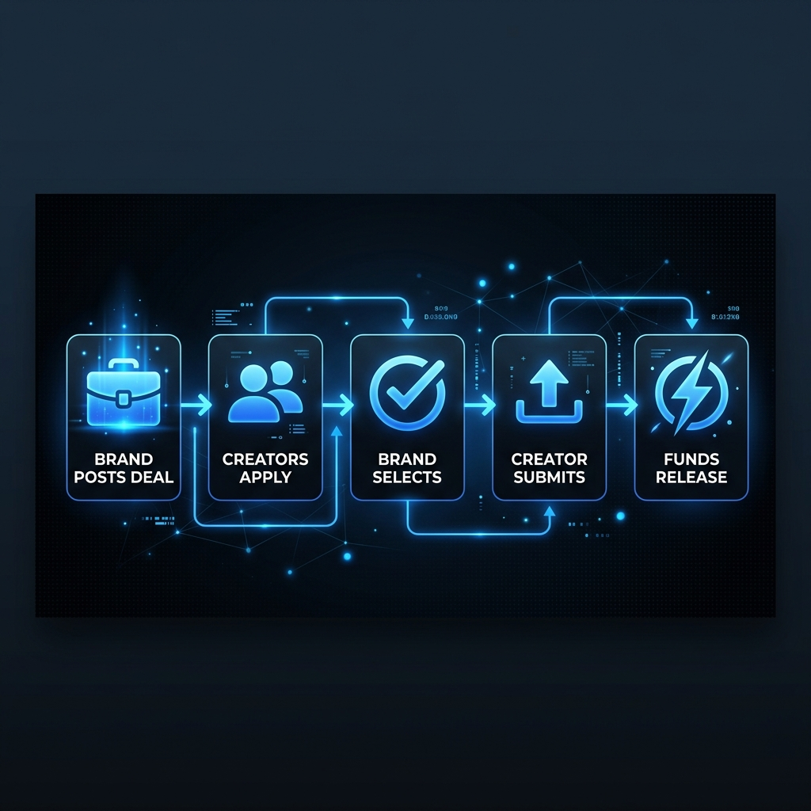
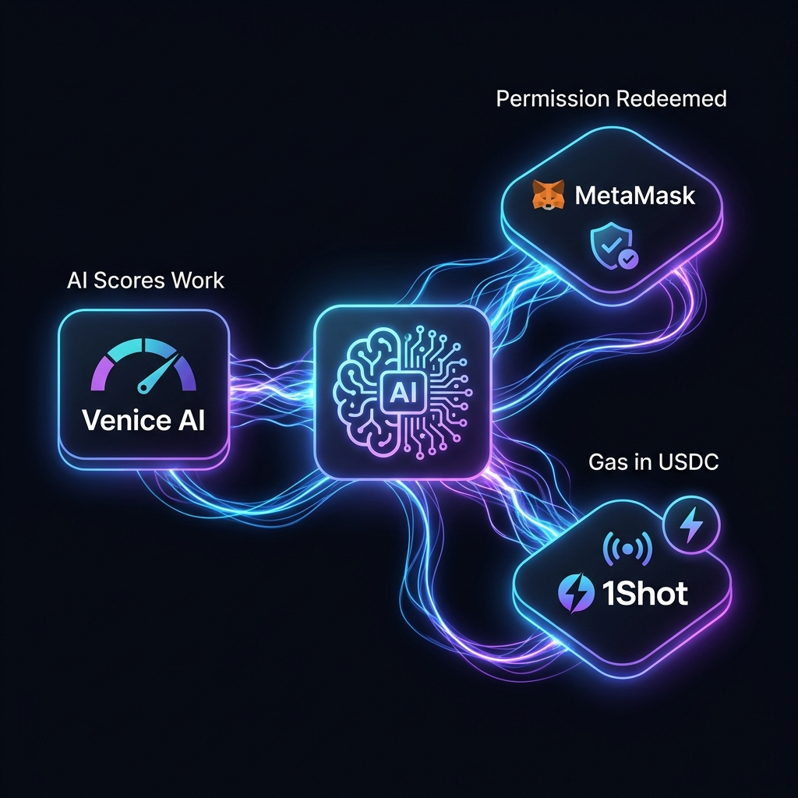
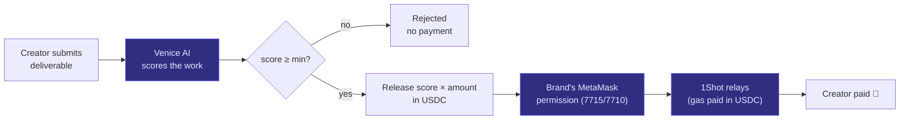
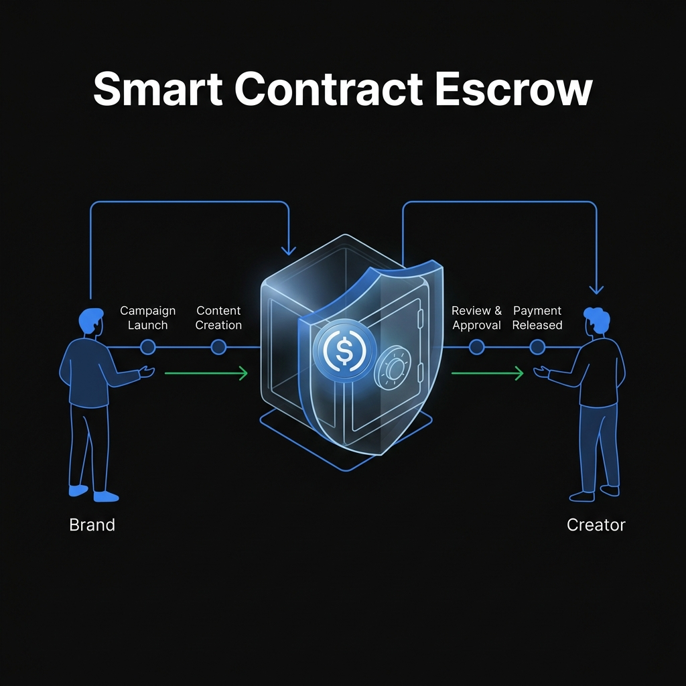

<p align="center">
  
</p>

<h1 align="center">FluxPay</h1>

<p align="center">
  <a href="https://flux-paydocs.vercel.app/"><strong>Official Documentation</strong></a> &nbsp;&bull;&nbsp;
  <a href="https://opensource.org/licenses/MIT"></a>
  <a href="https://nodejs.org/"></a>
  <a href="https://nextjs.org/"></a>
  <a href="https://soliditylang.org/"></a>
</p>

<p align="center">
  <strong>FluxPay</strong> is a creator-brand deal escrow platform. Brands post deals, creators apply, and USDC is locked in smart contracts per milestone. AI verifies deliverables automatically — payments release on approval, no trust required.
</p>

---

## Table of Contents

- [How it works](#how-it-works)
- [Technology Stack](#technology-stack)
- [Project Structure](#project-structure)
- [Prerequisites](#prerequisites)
- [Installation](#installation)
- [Configuration](#configuration)
- [Running the Project](#running-the-project)
- [API Reference](#api-reference)
- [Smart Contracts](#smart-contracts)
- [Deployment](#deployment)
- [Contributing](#contributing)
- [License](#license)

---

## How it works

<p align="center">
  
</p>

1. **Brand posts a deal** — sets milestones, budget, and content requirements. Funds lock into escrow.
2. **Creators apply** — browse open deals and submit an application with a cover note.
3. **Brand selects a creator** — reviews reputation, portfolio, and application.
4. **Creator submits deliverables** — uploads the content link per milestone. AI reviews it instantly against the brief.
5. **Funds release automatically** — on AI approval, USDC flows to the creator and on-chain reputation scores update.

Two user roles:

<table>
  <tr>
    <td width="80" align="center"></td>
    <td><strong>Creator</strong> — applies to brand jobs, delivers content, earns USDC per milestone.</td>
  </tr>
  <tr>
    <td width="80" align="center"></td>
    <td><strong>Organization (Brand)</strong> — posts deals, selects creators, funds escrow, monitors delivery.</td>
  </tr>
</table>

---

## ⚙️ The settlement engine (backend)

<p align="center">
  
</p>

The backend is where the three sponsor stacks fuse into one autonomous loop:

| Sponsor tech | Role in FluxPay |
|---|---|
| **MetaMask Smart Accounts** (ERC-7715 / ERC-7710) | Brands grant a spending permission; the agent redeems it to pay creators |
| **Venice AI** | Scores each deliverable against the brief and *decides the payout amount* |
| **1Shot API** | Relays payouts so gas is paid in **USDC** (mainnet) |

> A creator submits work → **Venice scores it** → the agent **releases the
> AI-determined amount of USDC** from the brand's pre-signed permission — with no
> human clicking "approve." Quality-weighted, autonomous, on-chain.



📖 **Official Documentation:** Visit the [FluxPay Official Docs](https://flux-paydocs.vercel.app/) for a comprehensive guide on the entire platform.

*(For detailed backend specifics, see [`backend/BackendReadme.md`](backend/BackendReadme.md)).*

---

## Technology Stack

### Frontend
| Layer | Choice |
|---|---|
| Framework | Next.js 14 (App Router, TypeScript) |
| Styling | Tailwind CSS |
| State | Zustand (persisted) |
| Server state | TanStack Query v5 |
| Auth / Wallet | Web3Auth (MetaMask Embedded Wallets) |
| EVM chains | wagmi + viem |
| Solana | Web3Auth SolanaProvider |
| UI extras | framer-motion, lucide-react, react-hot-toast, recharts |

### Backend
| Layer | Choice |
|---|---|
| Runtime | Node.js ≥ 20 (`node:http` — no framework) |
| Language | TypeScript (ESM, run via `tsx`) |
| Auth | Web3Auth JWT verification (JWKS or static PEM) |
| Storage | Neon Postgres (JSONB repos) — falls back to in-memory when unset |
| On-chain | viem + `@metamask/delegation-toolkit` (ERC-7715/7710) |
| AI | Venice AI (deliverable verification) |
| Relayer | 1Shot (USDC-gas payouts) |
| Deploy | Render (`render.yaml`) |

### Blockchain
| Layer | Choice |
|---|---|
| Language | Solidity ^0.8.0 |
| Contracts | `FluxPayEscrow`, `FluxPayEscrowFactory`, `MockUSDC` |
| Payment token | USDC |
| Networks | Ethereum, Base, Arbitrum + testnets (Sepolia, Base Sepolia) |
| Smart accounts | EIP-7702 (MetaMask AA via Web3Auth) |
| Bundler | Pimlico / ZeroDev (configured per chain via env vars) |

---

## Project Structure

```
FluxPay/
├── frontend/                        # Next.js 14 app (deployed to Vercel)
│   ├── src/
│   │   ├── app/
│   │   │   ├── page.tsx             # Landing page
│   │   │   ├── layout.tsx           # Root layout + providers
│   │   │   ├── auth/
│   │   │   │   ├── login/           # Sign in with smart wallet
│   │   │   │   └── signup/          # Role selection + wallet connect
│   │   │   ├── onboarding/
│   │   │   │   ├── creator/         # Creator profile setup
│   │   │   │   └── organization/    # Brand profile setup
│   │   │   ├── creator/
│   │   │   │   ├── dashboard/       # Browse deals, track applications
│   │   │   │   ├── deals/[dealId]/  # Active deal + milestone delivery
│   │   │   │   ├── wallet/          # USDC balance + transactions
│   │   │   │   ├── reputation/      # On-chain score
│   │   │   │   └── profile/
│   │   │   ├── organization/
│   │   │   │   ├── dashboard/       # Active campaigns overview
│   │   │   │   ├── jobs/new/        # Post a new deal
│   │   │   │   ├── jobs/[jobId]/    # Review applications, approve milestones
│   │   │   │   ├── wallet/          # Escrow balance + top-up
│   │   │   │   └── reputation/
│   │   │   └── api/balances/        # Next.js route handler (token balances)
│   │   ├── components/
│   │   │   ├── shared/              # Navbar, Modal, DataTable, etc.
│   │   │   └── ui/                  # Landing hero, decorative shapes
│   │   ├── config/
│   │   │   ├── web3authContext.ts   # Web3Auth + AA bundler config
│   │   │   └── wagmi.ts             # Wagmi config (type-check only)
│   │   ├── context/
│   │   │   └── WalletContext.tsx    # Web3Auth + Wagmi + Solana providers
│   │   ├── contracts/
│   │   │   ├── abis/                # FluxPayEscrow, Factory, MockUSDC ABIs
│   │   │   └── contracts.ts         # Deployed contract addresses
│   │   ├── hooks/                   # useWallet, useTokenBalances, useApi, etc.
│   │   ├── lib/
│   │   │   ├── mock-data.ts         # localStorage-backed mock DB
│   │   │   └── establishSession.ts  # POST /api/auth/session helper
│   │   ├── stores/
│   │   │   ├── userStore.ts         # Auth + role (Zustand, persisted)
│   │   │   └── jobStore.ts
│   │   └── types/index.ts           # Shared TypeScript types
│   ├── .env.example
│   ├── next.config.js
│   └── package.json
│
├── backend/                         # Node.js API (deployed to Render)
│   ├── src/
│   │   ├── index.ts                 # Entry point
│   │   ├── app.ts                   # HTTP server + route dispatch
│   │   ├── config/index.ts          # Env config
│   │   ├── database/connection.ts   # DB connect stub (in-memory until wired)
│   │   ├── middleware/index.ts      # Error → HTTP response
│   │   ├── models/
│   │   │   ├── user.ts              # InMemoryUserRepository
│   │   │   └── payment.ts           # InMemoryPaymentRepository
│   │   ├── routes/
│   │   │   ├── auth.ts              # POST /auth/session, GET /auth/me
│   │   │   └── payment.ts           # CRUD /payments
│   │   ├── services/
│   │   │   ├── authService.ts       # Web3Auth JWT verify + user upsert
│   │   │   └── paymentService.ts    # Payment business logic
│   │   └── utils/
│   │       ├── web3auth.ts          # JWT verification (JWKS or static PEM)
│   │       ├── validators.ts
│   │       ├── errors.ts
│   │       └── helpers.ts
│   ├── tests/
│   │   ├── payment.test.ts
│   │   └── services.test.ts
│   ├── .env.example
│   └── package.json
│
├── scripts/
│   └── setup-remotes.sh             # One-time dual-push git setup (see below)
│
├── render.yaml                      # Render deploy config for backend
├── .env.example
└── LICENSE
```

---

## Prerequisites

- **Node.js** v20.0.0 or higher
- **npm** v10+ (comes with Node 20)
- **Git**
- A **Web3Auth** project — get a free `clientId` at the [Web3Auth dashboard](https://dashboard.web3auth.io/)

---

## Installation

### 1. Clone the repository

```bash
git clone https://github.com/Dami904/FluxPay.git
cd FluxPay
```

### 2. Set up remotes (run once — for the whole team)

So that a single `git push` updates both the upstream repo and the team fork, each team member runs this once after cloning:

```bash
bash scripts/setup-remotes.sh
```

From then on, `git push` sends commits to both repos simultaneously. It's safe to re-run.

### 3. Install frontend dependencies

```bash
cd frontend
npm install
```

### 4. Install backend dependencies

```bash
cd ../backend
npm install
```

---

## Configuration

### Frontend — `frontend/.env.local`

Copy the example and fill in your values:

```bash
cp frontend/.env.example frontend/.env.local
```

```env
# Backend API
NEXT_PUBLIC_API_URL=http://localhost:3000

# Web3Auth (MetaMask Embedded Wallets)
NEXT_PUBLIC_CLIENT_ID=<your Web3Auth client ID from dashboard>

# Deployed contract addresses (already set in contracts.ts for testnet)
NEXT_PUBLIC_ESCROW_FACTORY_ADDRESS=0x58B92620Ce2Fa3dD61f0143Ea4f1bbF961130856
NEXT_PUBLIC_USDC_ADDRESS=0x2CeF50c5C6059F43180b1d91EFA354A9A837AdE1

# Optional: AA bundler URLs (one per chain you want smart accounts on)
NEXT_PUBLIC_BUNDLER_SEPOLIA=https://...
NEXT_PUBLIC_BUNDLER_BASE=https://...
```

### Backend — `backend/.env`

```env
PORT=3000
NODE_ENV=development

# Your Vercel/localhost frontend URL (for CORS)
FRONTEND_URL=http://localhost:3001

# Web3Auth — must match the client ID in the frontend
WEB3AUTH_CLIENT_ID=<your Web3Auth client ID>
JWKS_ENDPOINT=https://api-auth.web3auth.io/.well-known/jwks.json

# Optional: Postgres connection string (backend falls back to in-memory if unset)
DATABASE_URL=postgres://...
```

---

## Running the Project

### Frontend (Next.js dev server)

```bash
cd frontend
npm run dev
```

Available at `http://localhost:3000` (or 3001 if 3000 is taken).

### Backend (Node.js API)

```bash
cd backend
npm run dev
```

Available at `http://localhost:3000` by default. Set `PORT` in your `.env` to run on a different port.

### Type-checking

```bash
# Frontend
cd frontend && npx tsc --noEmit

# Backend
cd backend && npm run typecheck
```

---

## API Reference

Base URL: `http://localhost:3000/api`

### Auth

#### `POST /api/auth/session`

Verifies a Web3Auth `idToken`, upserts the user, and returns their profile. Called on every login/signup.

```json
// Request
{ "idToken": "<Web3Auth ID token>", "profileType": "creator" }

// Response
{ "user": { "id": "...", "email": "...", "profileType": "creator", "walletAddress": "0x..." } }
```

`profileType` is optional after signup — omit it on subsequent logins.

#### `GET /api/auth/me`

Returns the stored user for a bearer token. Used to restore session on page load.

```http
Authorization: Bearer <idToken>
```

### Payments

| Method | Path | Description |
|---|---|---|
| `POST` | `/api/payments` | Record a new payment |
| `GET` | `/api/payments` | List payments (filter by `userId`, `status`, `datasetId`) |
| `GET` | `/api/payments/:id` | Get a payment by ID |
| `GET` | `/api/payments/:id/status` | Get payment status + tx hash |
| `GET` | `/api/payments/history/:userId` | Get payment history for a user |
| `PATCH` | `/api/payments/:id/status` | Update status (`pending` / `completed` / `failed`) |

#### `GET /api/health`

```json
{ "status": "ok", "service": "fluxpay-backend", "storage": "memory" }
```

---

## Smart Contracts

<p align="center">
  
</p>

Three contracts are deployed and their ABIs are committed under `frontend/src/contracts/abis/`.

| Contract | Description |
|---|---|
| `FluxPayEscrowFactory` | Deploys a new `FluxPayEscrow` per deal |
| `FluxPayEscrow` | Holds USDC for one deal; releases per milestone on approval |
| `MockUSDC` | ERC20 test token (testnet only) |

**Deployed addresses (Hoodi testnet):**

```
USDC:            0x2CeF50c5C6059F43180b1d91EFA354A9A837AdE1
EscrowFactory:   0x58B92620Ce2Fa3dD61f0143Ea4f1bbF961130856
```

To interact with contracts, the frontend uses `wagmi` hooks and `viem`. The `WalletContext` wraps `Web3AuthProvider → WagmiProvider → SolanaProvider` so every hook has access to the connected wallet across EVM and Solana chains.

---

## Deployment

### Frontend → Vercel

Push to `main` — Vercel deploys automatically. Set all `NEXT_PUBLIC_*` env vars in the Vercel dashboard.

```bash
vercel --prod  # manual deploy
```

### Backend → Render

`render.yaml` is committed. Connect the repo in Render and set these secrets in the dashboard:

- `FRONTEND_URL` — your Vercel URL
- `WEB3AUTH_CLIENT_ID`
- `DATABASE_URL` (optional — uses in-memory if omitted)

Render will pick up the `buildCommand` / `startCommand` from `render.yaml` automatically.

---

## Security

- **Never commit `.env` files.** Use `.env.example` as the template.
- All Web3Auth `idToken`s are verified server-side on every request (signature + expiry + issuer). The backend never trusts the client's claimed identity.
- CORS is restricted to `FRONTEND_URL` in production.
- Smart contract private keys should never appear in frontend code — only use them in deploy scripts with proper secret management.

---

## Contributing

1. Fork the repository and run `bash scripts/setup-remotes.sh`
2. Create a feature branch: `git checkout -b feature/your-feature`
3. Commit your changes with a clear message
4. Push: `git push` (goes to both upstream and team fork)
5. Open a Pull Request against `main`

Use TypeScript for all new code. Match the existing code style — no comments unless the *why* is non-obvious.

---

## License

MIT — see the [LICENSE](LICENSE) file for details.
