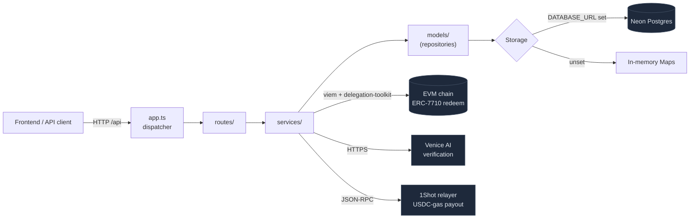
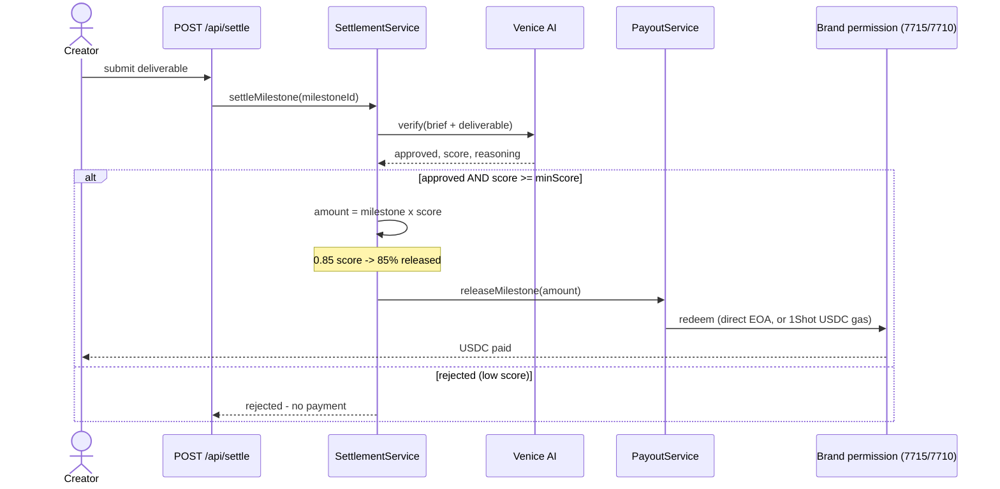
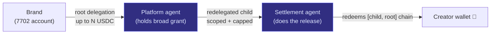

# FluxPay — Backend

The FluxPay backend is the **settlement engine** for a creator↔brand deal-escrow
platform. Brands post deals, creators deliver, an AI verifies the work, and USDC
is released on-chain — autonomously, with no human clicking "approve."

It integrates the three hackathon sponsor stacks end-to-end:

| Sponsor tech | Role in FluxPay |
|---|---|
| **MetaMask Smart Accounts** (ERC-7715 / ERC-7710) | Brands grant a spending permission; the agent redeems it to pay creators |
| **Venice AI** | Scores each deliverable against the brief and *decides the payout* |
| **1Shot API** | Relays payouts so gas is paid in **USDC** (mainnet) |

---

## Table of contents

- [Architecture](#architecture)
- [The headline flow](#the-headline-flow)
- [Feature reference](#feature-reference)
  - [1. Persistence — Neon Postgres](#1-persistence--neon-postgres)
  - [2. Multichain registry](#2-multichain-registry)
  - [3. MetaMask Smart Accounts — grant & redeem](#3-metamask-smart-accounts--grant--redeem)
  - [4. Venice AI — deliverable verification](#4-venice-ai--deliverable-verification)
  - [5. AI-scored partial payouts](#5-ai-scored-partial-payouts)
  - [6. Autonomous settlement (the agent)](#6-autonomous-settlement-the-agent)
  - [7. 1Shot — USDC-gas payout rail](#7-1shot--usdc-gas-payout-rail)
  - [8. A2A redelegation](#8-a2a-redelegation)
  - [9. USDC welcome faucet](#9-usdc-welcome-faucet)
- [API reference](#api-reference)
- [Environment variables](#environment-variables)
- [Running & validation harnesses](#running--validation-harnesses)
- [What's validated vs. what needs funds](#whats-validated-vs-what-needs-funds)

---

## Architecture

- **Runtime:** Node.js ≥ 20, **`node:http` with no framework** — routing is a
  string-split dispatcher in [`src/app.ts`](src/app.ts).
- **Pattern:** every domain is a **vertical slice** — `model` (repository) →
  `service` (business logic) → `route` (HTTP handler) → wired in `app.ts`.
- **Dependency injection:** `createApp(options)` lets every repository/service be
  overridden, so tests inject in-memory repos and the suite never touches a DB.
- **Storage:** in-memory `Map` repositories by default; **Neon Postgres**
  repositories swap in automatically when a connection string is present — same
  interface, zero changes to services or routes.
- **On-chain:** [`viem`](https://viem.sh) + the
  [`@metamask/delegation-toolkit`](https://www.npmjs.com/package/@metamask/delegation-toolkit)
  for ERC-7715/7710 delegations.



---

## The headline flow

This is what makes FluxPay stand out — a single autonomous loop that fuses all
three sponsor techs:



> **Scenario.** Nike posts a $100 reel deal and selects creator Joshua. Joshua
> submits the reel. FluxPay calls `POST /api/settle`. Venice scores it **0.9**
> ("AirMax shown, @nike tagged, #JustDoIt present"). The agent releases
> **$90 USDC** from Nike's pre-authorized permission — and Joshua is paid before
> anyone at Nike opens the dashboard.

---

## Feature reference

### 1. Persistence — Neon Postgres

**Files:** [`src/database/`](src/database/), [`src/models/postgres.ts`](src/models/postgres.ts)

The backend originally kept everything in RAM `Map`s, which wiped on every
restart (fatal on Render's free tier). Now every entity is persisted to **Neon
Postgres**.

- Each entity is stored as a **`JSONB` blob** (the full record) plus a few
  promoted columns used only for filtering/sorting. New fields never need a
  migration, and the Postgres repos are a **1:1 drop-in** for the in-memory ones.
- `defaultRepositories()` in [`app.ts`](src/app.ts) picks Postgres when a
  connection string is set, else in-memory (so tests stay DB-free).
- Connection string is read from **`DATABASE_URL` *or* `POSTGREL_URL`**.
- Schema is created idempotently on boot ([`connection.ts`](src/database/connection.ts)).

> **Scenario.** Render restarts overnight. With in-memory storage every brand,
> job, and granted permission would vanish. With Neon, the agent wakes up and can
> still redeem yesterday's signed permissions — nothing is lost.

### 2. Multichain registry

**Files:** [`src/config/chains.ts`](src/config/chains.ts)

A single source of truth for every chain the app runs on:

- **8 mainnets** (the chains 1Shot relays on): Ethereum, Base, Arbitrum, Optimism,
  Polygon, BNB Chain, Linea, Scroll — each with its canonical **USDC** address.
- **1 testnet:** Base Sepolia (for local/dev testing).
- Select the active chain with **`NETWORK_MODE=mainnet|testnet`** (default
  `mainnet` → Base) or pin one with **`ACTIVE_CHAIN_ID`**.
- The active chain drives the agent RPC, USDC address, faucet, and redeem chain —
  flip one env var and the whole backend moves networks.

> **Scenario.** For the 1Shot track you set `ACTIVE_CHAIN_ID=8453` (Base mainnet)
> and the agent, redeem, and relayer all target Base + real USDC. For day-to-day
> dev you set `NETWORK_MODE=testnet` and everything moves to Base Sepolia — and
> the faucet automatically turns back on (see [§9](#9-usdc-welcome-faucet)).

### 3. MetaMask Smart Accounts — grant & redeem

**Files:** [`models/permission.ts`](src/models/permission.ts),
[`services/permissionService.ts`](src/services/permissionService.ts),
[`services/redeemService.ts`](src/services/redeemService.ts),
[`services/payoutService.ts`](src/services/payoutService.ts),
[`routes/permission.ts`](src/routes/permission.ts)

Every brand and creator gets a **MetaMask smart account** (EIP-7702) at sign-in
via Web3Auth. The escrow uses **Advanced Permissions**:

- **Grant (ERC-7715):** when a brand selects a creator, it signs **one**
  permission — *"release up to `budget` USDC for this job's milestones"* — and the
  signed `permissionsContext` is stored against the job (`POST /api/permissions`).
- **Redeem (ERC-7710):** `RedeemService` uses the agent wallet to redeem that
  permission and transfer USDC to the creator — **no per-payout signature** from
  the brand.
- `PayoutService` orchestrates: permission → creator wallet → amount → release,
  and records the result on the permission (`last_payout`).

> **Scenario.** Nike signs **one** permission when hiring Joshua. Across three
> milestones, the agent releases funds three times — Nike never signs again.
> *"Funds release automatically, no trust required."*

### 4. Venice AI — deliverable verification

**Files:** [`services/veniceService.ts`](src/services/veniceService.ts),
[`services/verificationService.ts`](src/services/verificationService.ts),
[`routes/verification.ts`](src/routes/verification.ts)

Replaces manual milestone approval with an AI judgment.

- `VerificationService` builds a **brief** from the job (`target_platform`,
  `post_type`, required hashtags/mentions/brand tag) and sends it with the
  creator's `deliverable_url`/`deliverable_note` to a **Venice vision model**.
- Returns a structured verdict: **`{ approved, score, reasoning, missing }`** and
  records it on the milestone as `ai_verification` metadata.
- OpenAI-compatible; tolerant JSON parsing (handles fenced output). Safe no-op
  until `VENICE_API_KEY` is set.
- Endpoint: `POST /api/verify { milestoneId }`.

> **Scenario.** Joshua submits an Instagram reel. Venice checks: is it a reel? is
> the product shown? is @nike tagged? is #JustDoIt present? → `approved: true,
> score: 0.9, reasoning: "..."`.

### 5. AI-scored partial payouts

**Files:** [`services/settlementService.ts`](src/services/settlementService.ts),
[`services/payoutService.ts`](src/services/payoutService.ts)

The Venice **score sets the payout amount** — not just a yes/no.

- `PayoutService.releaseMilestone(id, { amountUsdc })` releases an arbitrary
  amount, **capped** at the milestone amount (and the on-chain permission ceiling).
- The settlement agent computes `milestone.amount × score` and releases that.

> **Scenario.** A $100 milestone scores **0.85** → exactly **$85 USDC** is
> released, with the reasoning attached. Quality is rewarded proportionally, and
> the spending cap guarantees it can never exceed the milestone.

### 6. Autonomous settlement (the agent)

**Files:** [`services/settlementService.ts`](src/services/settlementService.ts),
[`routes/verification.ts`](src/routes/verification.ts)

The piece that makes FluxPay an **agent**, not a form. `POST /api/settle`:

1. Calls Venice to verify the deliverable.
2. Gates on `approved` **and** `score ≥ minScore` (default 0.5).
3. Marks the milestone approved (the AI's verdict *is* the approval).
4. Releases the **scored** USDC via `PayoutService` (`direct` redeem or 1Shot relay).

No human in the loop — the AI verdict is the on-chain trigger.

> **Scenario.** One API call turns "creator submitted work" into "creator has been
> paid the AI-determined amount in USDC," with a recorded reason. A low score
> (e.g. 0.2 < 0.5) returns `rejected` and pays nothing.

### 7. 1Shot — USDC-gas payout rail

**Files:** [`services/relayerService.ts`](src/services/relayerService.ts),
[`services/payoutService.ts`](src/services/payoutService.ts)

A second payout rail where **gas is paid in USDC** instead of ETH, via 1Shot's
permissionless relayer (no API key).

- `RelayerService` speaks 1Shot's JSON-RPC: `getCapabilities`, `getFeeData`,
  `estimate`, `send7710Transaction`, `getStatus`.
- **Fee token is never hardcoded** — USDC is picked live from `getCapabilities`
  per chain.
- Selected via `POST /api/permissions/redeem { milestoneId, via: "relayer" }` (or
  `via: "direct"` for the EOA/ETH-gas path).
- **Mainnet only** — 1Shot returns empty capabilities for testnets; the service
  detects this and fails gracefully.

> **Scenario.** On Base mainnet, the agent relays Joshua's payout through 1Shot.
> The gas fee (~$0.01) is deducted **in USDC** from the brand's funds — the agent
> never needs ETH, and Joshua receives USDC gaslessly.

### 8. A2A redelegation

**Files:** [`services/redelegationService.ts`](src/services/redelegationService.ts),
[`scripts/a2a-harness.ts`](scripts/a2a-harness.ts)

Agent-to-Agent coordination through **delegation redelegation**:



- The platform agent holds the brand's broad grant but **redelegates a narrower,
  per-job permission** to a settlement agent that performs the actual release.
- The child delegation's `authority` cryptographically **links to the parent**, so
  the settlement agent's power is bounded by — and traceable to — the brand's grant.
- **Security:** a leak of the settlement key can spend at most the redelegated cap
  for one job, never the brand's full authorization.

> **Scenario.** The "master" platform agent is the only account that ever holds
> the brand's full permission, but it never touches funds. A scoped settlement
> agent does the payouts — so a compromise is contained to a single job.

### 9. USDC welcome faucet

**Files:** [`services/faucetService.ts`](src/services/faucetService.ts),
[`routes/faucet.ts`](src/routes/faucet.ts)

On first signup, a new wallet receives a **one-time $2 testnet USDC** drip (a gas
budget for the USDC-paymaster UX).

- **Idempotent per address** — recorded in the Neon `faucet_drips` table; survives
  restarts.
- **Testnet only** — auto-disabled on mainnet (you can't hand out free real USDC).
- Endpoint: `POST /api/faucet/drip { address }`. Safe no-op until
  `FAUCET_PRIVATE_KEY` is set.

> **Scenario.** A judge tries the testnet demo, signs up, and instantly has $2
> USDC to transact with — no faucet hunting. On mainnet the same code is inert,
> because gas is covered by the sponsored paymaster + 1Shot instead.

---

## API reference

All paths are prefixed with `/api`. Most require `Authorization: Bearer <idToken>`
(the Web3Auth identity token).

### Auth & profile
| Method | Path | Body |
|---|---|---|
| POST | `/api/auth/session` | `{ idToken, profileType? }` |
| GET | `/api/auth/me` | — |
| GET | `/api/profile/me` | — |
| PUT | `/api/profile/me` | `{ name, bio, website_url, profile_picture_url, niche_tags }` |
| GET | `/api/profile/reputation/:wallet` | — |

### Jobs & milestones
| Method | Path | Body / Query |
|---|---|---|
| GET / POST | `/api/jobs` | filters / job fields |
| GET | `/api/jobs/mine` | `?status&page` |
| GET | `/api/jobs/:id` | — |
| POST | `/api/jobs/:id/apply` | `{ cover_note }` |
| GET | `/api/jobs/:id/applications` | — |
| POST | `/api/jobs/:id/select/:creatorId` | — |
| GET | `/api/jobs/:id/milestones` | — |
| POST | `/api/milestones/:id/submit` | `{ deliverable_url, deliverable_note? }` |
| POST | `/api/milestones/:id/approve` | — |

### Sponsor-tech endpoints (added this build)
| Method | Path | Body | Tech |
|---|---|---|---|
| POST | `/api/permissions` | `{ jobId, permissions_context, delegation_manager, token_address, amount, chain_id, ... }` | MetaMask (store grant) |
| GET | `/api/permissions/:jobId` | — | MetaMask |
| POST | `/api/permissions/redeem` | `{ milestoneId, via: "direct"\|"relayer" }` | MetaMask + 1Shot |
| POST | `/api/verify` | `{ milestoneId }` | Venice AI |
| POST | `/api/settle` | `{ milestoneId, via?, minScore? }` | **All three** (autonomous loop) |
| POST | `/api/faucet/drip` | `{ address }` | testnet faucet |

### Wallet, reputation, applications, health
| Method | Path |
|---|---|
| GET | `/api/wallet/balance` · POST `/api/wallet/deposit` · POST `/api/wallet/withdraw` · GET `/api/wallet/transactions` |
| GET | `/api/reputation/:wallet` |
| GET | `/api/applications/mine` |
| GET | `/health` → `{ status, storage }` |

**Error shape:** `{ "error": { "code": "...", "message": "..." } }`.

---

## Environment variables

| Variable | Purpose | Default |
|---|---|---|
| `PORT` | HTTP port | `8000` |
| `FRONTEND_URL` | CORS origin | `*` |
| `DATABASE_URL` / `POSTGREL_URL` | Neon Postgres connection string | _(in-memory if unset)_ |
| `NETWORK_MODE` | `mainnet` \| `testnet` | `mainnet` |
| `ACTIVE_CHAIN_ID` | Pin a specific chain | Base (8453) / Base Sepolia in testnet |
| `RPC_<chainId>` | Custom RPC per chain | public RPCs |
| `FAUCET_PRIVATE_KEY` | Testnet faucet wallet (also default agent) | — |
| `FAUCET_DRIP_USDC` | Welcome drip amount | `2` |
| `AGENT_PRIVATE_KEY` | Redeem/payout agent (falls back to faucet key) | — |
| `SETTLEMENT_AGENT_PRIVATE_KEY` | A2A settlement agent | — |
| `VENICE_API_KEY` | Venice AI key | — |
| `VENICE_MODEL` | Vision model | `claude-opus-4-7` |
| `ONESHOT_RELAYER_URL` | 1Shot relayer endpoint | `https://relayer.1shotapi.com/relayers` |
| `ONESHOT_CHAIN_ID` | Relay chain | active chain (mainnet) |
| `WEB3AUTH_CLIENT_ID` | Token audience check | — |
| `WEB3AUTH_ALLOW_UNVERIFIED` | Devnet: skip signature, enforce aud/iss/exp | `false` |

---

## Running & validation harnesses

```bash
# install
npm install

# typecheck + tests (in-memory, no DB needed)
npm run typecheck
node --import tsx --test tests/*.test.ts        # 40/40 passing

# dev server
npm run dev                                      # http://localhost:8000
```

**On-chain validation harnesses** (prove the delegation machinery on a real chain,
using the same Stateless7702 account type real users get):

```bash
# ERC-7710 redeem: brand (7702) grants → agent redeems → creator paid
node --import tsx scripts/redeem-harness.ts

# A2A: brand → platform → redelegated settlement agent → creator paid
node --import tsx scripts/a2a-harness.ts
```

Both read keys from env and print the addresses to fund + a pass/fail with the
on-chain tx hash. The brand's address (an EOA upgraded in place via EIP-7702)
both holds USDC and grants the delegation — exactly like a production Web3Auth
wallet.

---

## What's validated vs. what needs funds

| Capability | Status |
|---|---|
| Neon persistence (all entities) | ✅ live round-trips verified |
| Chain registry / mainnet↔testnet switch | ✅ verified across modes |
| Venice verification (disabled-path + parsing) | ✅ verified; live needs API credits |
| AI-scored autonomous settlement | ✅ verified (0.8 → 80%, low-score → rejected) |
| 1Shot relayer (capabilities, USDC pick, fee quote) | ✅ live against Base mainnet |
| ERC-7715 grant storage / payout orchestration | ✅ verified end-to-end |
| Redelegation chain construction | ✅ child→parent link verified off-chain |
| On-chain redeem / A2A (actual USDC movement) | ⏳ needs funded keys on a 7702 chain |

> The on-chain redeem/A2A harnesses are intricate delegation-toolkit code that
> can only be fully exercised with funded wallets. Everything else is validated in
> CI / live API calls.
