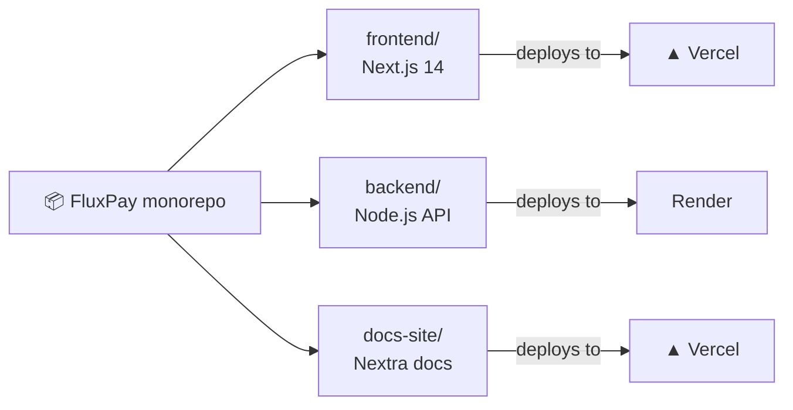

# Project Structure

Three workspaces, two deploy targets:



```
FluxPay/
├── frontend/                        # Next.js 14 app (deployed to Vercel)
│   ├── src/
│   │   ├── app/                     # App Router pages
│   │   │   ├── page.tsx             # Landing page
│   │   │   ├── layout.tsx           # Root layout + providers
│   │   │   ├── auth/                # Login / signup
│   │   │   ├── onboarding/          # Creator / brand profile setup
│   │   │   ├── creator/             # Creator dashboard, deals, wallet
│   │   │   ├── organization/        # Brand dashboard, jobs, approvals
│   │   │   ├── explore/             # Browse jobs & creators
│   │   │   └── api/                 # Next.js API routes
│   │   ├── components/
│   │   │   ├── shared/              # Navbar, Modal, DataTable, etc.
│   │   │   └── ui/                  # Landing hero, decorative shapes
│   │   ├── config/                  # Web3Auth + chain settings
│   │   ├── context/                 # WalletProvider (Web3Auth → Wagmi → Solana)
│   │   ├── contracts/               # ABIs + deployed addresses
│   │   ├── hooks/                   # useWallet, useApi, useForm, etc.
│   │   ├── lib/                     # API client, mock data, WebSocket
│   │   ├── stores/                  # Zustand stores (user, job)
│   │   └── types/                   # Shared TypeScript types
│   └── package.json
│
├── backend/                         # Node.js API (deployed to Render)
│   ├── src/
│   │   ├── index.ts                 # Entry point
│   │   ├── app.ts                   # HTTP server + route dispatch
│   │   ├── config/                  # Env config + chain registry
│   │   ├── database/                # Postgres connection + schema
│   │   ├── middleware/              # Error → HTTP response
│   │   ├── models/                  # In-memory + Postgres repositories
│   │   ├── routes/                  # HTTP handlers
│   │   ├── services/                # Business logic (15 services)
│   │   └── utils/                   # JWT verify, validators, errors
│   ├── tests/                       # Test suite (11 files)
│   ├── scripts/                     # On-chain validation harnesses
│   └── package.json
│
├── docs/                            # This documentation (GitBook)
├── scripts/
│   └── setup-remotes.sh             # Dual-push git setup
├── render.yaml                      # Render deploy config
└── LICENSE                          # MIT
```
