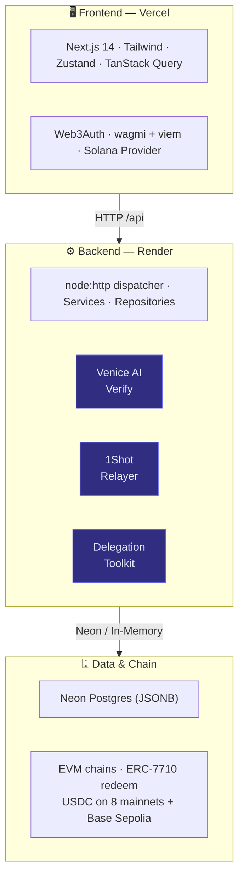

# System Overview

## Architecture Diagram

FluxPay is a three-tier system: a Next.js frontend (Vercel), a Node.js backend (Render), and smart contracts on EVM chains.



## Backend Architecture Pattern

The backend follows a **vertical slice** pattern:

```
Model (Repository) → Service (Business Logic) → Route (HTTP Handler) → app.ts (Dispatcher)
```

* **Models** define data interfaces and repository implementations (in-memory + Postgres)
* **Services** contain all business logic and external integrations
* **Routes** create HTTP handler functions that call services
* **`app.ts`** wires everything together with dependency injection via `createApp(options)`

This enables full testability — tests inject in-memory repos and never touch a database.

## Storage Strategy

The backend implements a **dual-storage** strategy:

| Mode                | Trigger                | Use Case                                |
| ------------------- | ---------------------- | --------------------------------------- |
| **Neon Postgres**   | `DATABASE_URL` is set  | Production — JSONB blobs, survives restart |
| **In-Memory Maps**  | `DATABASE_URL` unset   | Tests, local dev — fast, no setup        |

Both implement identical repository interfaces. The switch is automatic via `defaultRepositories()` in `app.ts`. JSONB storage means new fields never require schema migrations.

## Frontend Architecture

The frontend uses Next.js 14's App Router with:

* **Server Components** for static pages (landing, about, FAQs)
* **Client Components** for interactive dashboards
* **Web3Auth Provider** wrapping wagmi + Solana providers for multi-chain wallet access
* **Zustand** for client state (auth, role)
* **TanStack Query** for server state (API data with caching)
