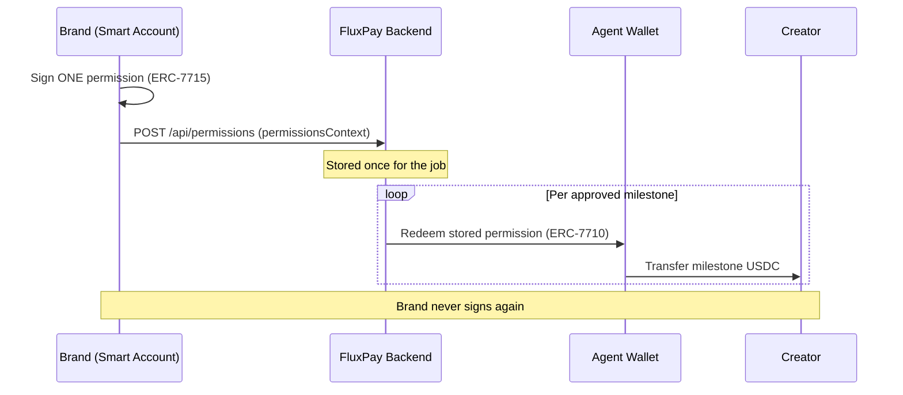

# MetaMask Smart Accounts

## Overview

Every user gets a **MetaMask smart account** (EIP-7702) at sign-in via Web3Auth. The escrow uses **Advanced Permissions** for autonomous payments.

## Grant Flow (ERC-7715)

1. Brand selects a creator for a deal
2. Brand signs **one** permission: _"release up to `budget` USDC for this job's milestones"_
3. The signed `permissionsContext` is stored via `POST /api/permissions`

## Redeem Flow (ERC-7710)

1. `RedeemService` uses the agent wallet to redeem the stored permission
2. USDC transfers from the brand's smart account to the creator
3. **No per-payout signature** from the brand is needed

## Flow Diagram

One signature from the brand (ERC-7715), then the agent redeems per milestone (ERC-7710) with no further signatures:

## Example

> Nike signs **one** permission when hiring Joshua. Across three milestones, the agent releases funds three times — Nike never signs again. _"Funds release automatically, no trust required."_

## Key Files

| File                          | Purpose                        |
| ----------------------------- | ------------------------------ |
| `models/permission.ts`        | Permission repository          |
| `services/permissionService.ts` | Storage and retrieval        |
| `services/redeemService.ts`   | ERC-7710 delegation redemption |
| `services/payoutService.ts`   | Payout orchestration           |
