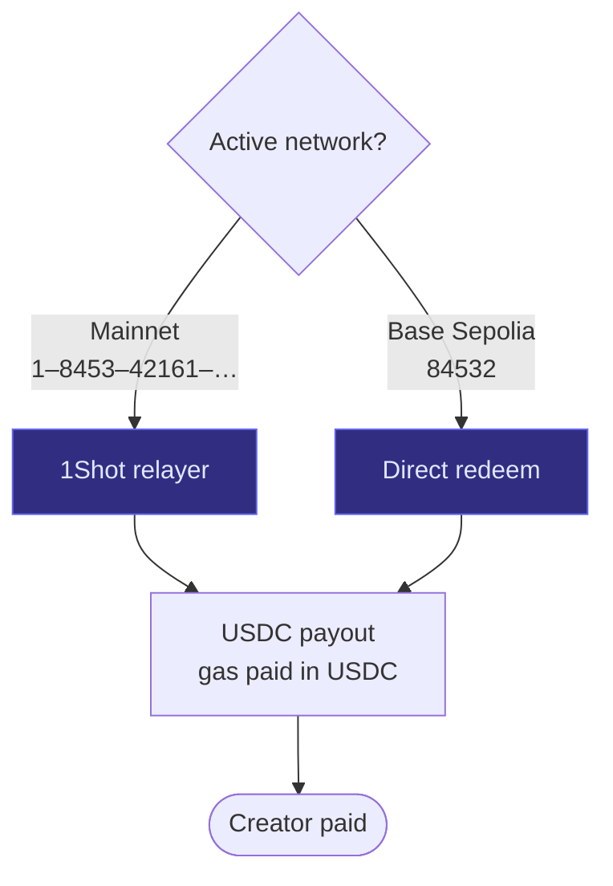

# Multichain Support

## Supported Chains

FluxPay supports 9 chains — 8 mainnets (1Shot-supported) and 1 testnet:

| Chain          | Chain ID | USDC Address                                         | Testnet |
| -------------- | -------- | ---------------------------------------------------- | ------- |
| Ethereum       | 1        | `0xa0b86991c6218b36c1d19d4a2e9eb0ce3606eb48`         | No      |
| Base           | 8453     | `0x833589fCD6eDb6E08f4c7C32D4f71b54bdA02913`         | No      |
| Arbitrum       | 42161    | `0xaf88d065e77c8cC2239327C5EDb3A432268e5831`         | No      |
| Optimism       | 10       | `0x0b2C639c533813f4Aa9D7837CAf62653d097Ff85`         | No      |
| Polygon        | 137      | `0x3c499c542cEF5E3811e1192ce70d8cC03d5c3359`         | No      |
| BNB Chain      | 56       | `0x8ac76a51cc950d9822d68b83fe1ad97b32cd580d`         | No      |
| Linea          | 59144    | `0x176211869cA2b568f2A7D4EE941E073a821EE1ff`         | No      |
| Scroll         | 534352   | `0x06eFdBFf2a14a7c8E15944D1F4A48F9F95F663A4`         | No      |
| Base Sepolia   | 84532    | `0x036CbD53842c5426634e7929541eC2318f3dCF7e`         | Yes     |

## Network Selection

Control which chain the backend runs on with two environment variables:

| Env Var            | Purpose                          | Default                           |
| ------------------ | -------------------------------- | --------------------------------- |
| `NETWORK_MODE`     | `mainnet` or `testnet`           | `mainnet` → Base (8453)           |
| `ACTIVE_CHAIN_ID`  | Pin a specific chain             | Base (mainnet) / Base Sepolia     |
| `RPC_<chainId>`    | Custom RPC URL per chain         | Public RPCs                       |

### Examples

```bash
# Base mainnet (default for production)
NETWORK_MODE=mainnet

# Base Sepolia testnet (for development)
NETWORK_MODE=testnet

# Pin to Arbitrum specifically
ACTIVE_CHAIN_ID=42161
```


The active chain drives the agent RPC, USDC address, faucet, and redeem chain. Flip one env var and the whole backend moves networks.


## Settlement Paths

The release path depends on the active network — **1Shot does not support testnets**, so Base Sepolia redeems directly:



## Chain Registry

All chain definitions live in `backend/src/config/chains.ts` — a single source of truth. USDC addresses are sourced from 1Shot's `getCapabilities` response.
