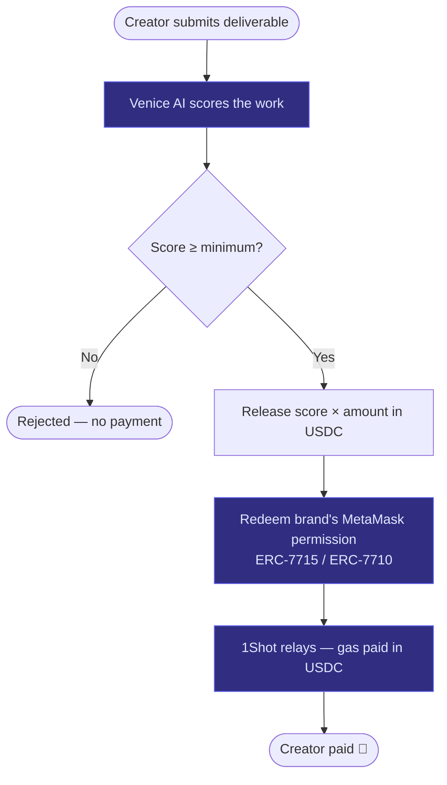

# The Settlement Engine

## Overview

The settlement engine is FluxPay's core innovation — a single autonomous loop that fuses all three sponsor technologies to pay creators without human intervention.

## How It Works

1. Creator submits a deliverable (content link)
2. Venice AI verifies it against the job brief
3. The AI score determines the payout amount (e.g., 0.85 score → 85% of milestone)
4. The agent redeems the brand's pre-signed MetaMask permission
5. USDC is transferred to the creator (directly or via 1Shot relayer)

## The Flow



## Example Scenario

> Nike posts a $100 reel deal and selects creator Joshua. Joshua submits the reel. FluxPay calls `POST /api/settle`. Venice scores it **0.9** ("AirMax shown, @nike tagged, #JustDoIt present"). The agent releases **$90 USDC** from Nike's pre-authorized permission — and Joshua is paid before anyone at Nike opens the dashboard.

## API Endpoint

```
POST /api/settle
```

**Body:**

```json
{
  "milestoneId": "milestone-uuid",
  "via": "direct",
  "minScore": 0.5
}
```

**Response (approved):**

```json
{
  "settled": true,
  "stage": "released",
  "verification": {
    "approved": true,
    "score": 0.9,
    "reasoning": "AirMax product visible, @nike tagged, #JustDoIt hashtag present"
  },
  "payout": {
    "amount": "90.00",
    "currency": "USDC",
    "via": "direct"
  }
}
```

## Auto-Settlement

When a creator submits a milestone via `POST /api/milestones/:id/submit`, the settlement engine automatically fires in a **fire-and-forget** fashion:

* Venice verifies and scores
* USDC is released if approved
* The submit response is never blocked by settlement
* No-ops gracefully if Venice or agent keys aren't configured


The settlement engine is the only place where all three sponsor technologies (MetaMask, Venice AI, 1Shot) converge into a single code path.

